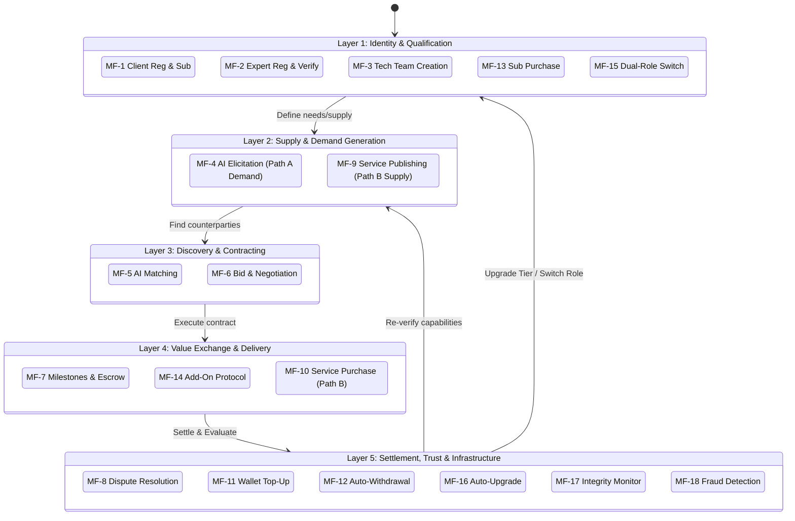
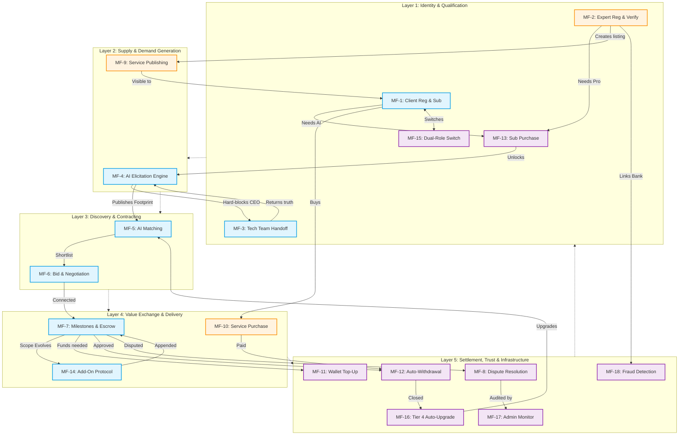
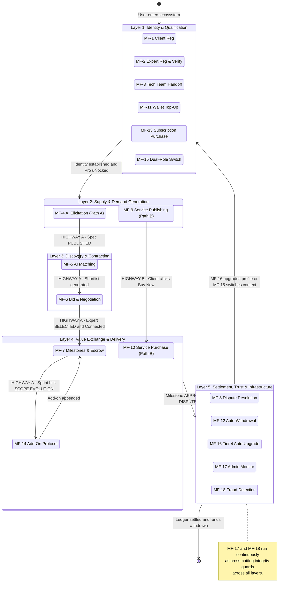
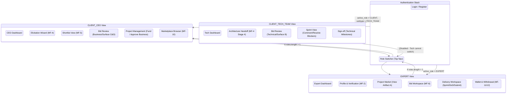

1/ 

```mermaid
stateDiagram-v2
    direction LR
   
    state "ECOSYSTEM SETUP" as Setup {
        MF1_Client_Onboarding : MF-1 Client Reg (incl. MF-11 TopUp, MF-13 Sub)
        MF2_Expert_Onboarding : MF-2 Expert Reg (incl. MF-11 TopUp, MF-13 Sub)
        MF3_TechTeam_Handoff : MF-3 Tech Team Handoff
        MF15_Dual_Role : MF-15 Dual-Role Switch
    }
   
    state "PATH A: AI PROJECT FLOW" as PathA {
        MF4_Elicitation : MF-4 Elicitation (RQ2 Core)
        MF5_Matching : MF-5 Matching (RQ1 Core)
        MF6_Bidding : MF-6 Bid & Connection
        MF7_Escrow : MF-7 Milestones & Escrow (RQ3 Core)
    }
   
    state "PATH B: MARKETPLACE" as PathB {
        MF9_Service_Publish : MF-9 Service Publish
        MF10_Service_Buy : MF-10 Service / Tech Discovery Buy
    }

    state "TRUST & INTEGRITY" as Trust {
        MF8_Disputes : MF-8 Dispute Resolution (RQ3 Core)
        MF12_Withdrawal : MF-12 Auto-Withdrawal
        MF14_Scope_Evo : MF-14 Add-On Protocol
        MF16_Verification : MF-16 Tier 4 Auto-Upgrade
        MF17_Admin_Monitor : MF-17 Admin Monitor
        MF18_Fraud_Detection : MF-18 Fraud Detection
    }

    [*] --> Setup
    Setup --> PathA : CEO initiates project
    Setup --> PathB : CEO browses services
   
    PathA --> Trust : Engagement Active
    PathB --> Trust : Payment Held
   
    Trust --> [*] : Funds Released / Disputed

```

2/

3/

4/

5/

## Part 1: High-Level Navigation Map

The AITasker UI is **role-driven**. The navigation bar completely re-renders based on the JWT's `active_role`.

---

## Part 2: Screen Inventory & Components

###  1. CLIENT / CEO Screens
*Goal: Help non-technical users define problems, pick the right expert, and manage budgets.*

| Screen Name | Core Purpose | Key UI Components | Mapped Flows |
|---|---|---|---|
| **CEO Dashboard** | Command center | Wallet Balance Card, Pro Subscription Badge, "Start New AI Project" CTA, Active Project Cards | MF-1, MF-11, MF-13 |
| **AI Elicitation Wizard** | Guided conversation | Step Indicator (1-5), Chat-style Input, Archetype Selector Cards, "Inject Phase 0" system message, **Hard-Block Modal** (Generate Handoff Link) | MF-4, MF-3 |
| **Shortlist View** | Compare matched experts | Match Cards (Strong/Qualified labels), **Seam Gap Map Visual**, Stack Tag Overlaps, "Select Expert" button | MF-5 |
| **Bid Review (CEO)** | Negotiate business terms | Bid Version History, Tech Team Recommendation Badge, **Surface C (Price Negotiation Panel)**, **Surface D (Override Modal with mandatory reason input)** | MF-6 |
| **Project Management** | Track budget & milestones | Milestone Timeline, "Fund Milestone" button (generates VietQR modal), Business Milestone Sign-off button | MF-7 |
| **Marketplace Browser** | Buy direct services | Service Cards, "Buy Now" button, Service Detail Page | MF-9, MF-10 |

###  2. CLIENT / TECH_TEAM Screens
*Goal: Provide technical reality, validate expert approaches, and track code-level delivery.*

| Screen Name | Core Purpose | Key UI Components | Mapped Flows |
|---|---|---|---|
| **Tech Dashboard** | Technical tasks | Pending Handoff Alerts, Active Sprint Alerts, Technical Sign-off Queue | MF-3, MF-7 |
| **Architecture Handoff** | Populate Artifact B | Stack Tag Multi-select, Integration Method Dropdown, File Upload Zone (schema/topology) | MF-4 (Stage 4) |
| **Bid Review (Tech)** | Validate tech approach | Bid Version History, **Surface B (Request Revision Modal - targeting specific component)**, Recommend/Not Recommend Toggle | MF-6 |
| **Sprint View** | Monitor delivery | Sprint Status Badge (On Track/Blocker), **Blocker Resolution Input**, Sprint Comment Thread | MF-7, MF-14 |
| **Sign-off (Tech)** | Approve technical deliverables | DoD Checklist Read-only View, Technical Acceptance Criteria, Sign-off Button | MF-7 |

###  3. EXPERT Screens
*Goal: Prove capability, win bids, deliver work, get paid automatically.*

| Screen Name | Core Purpose | Key UI Components | Mapped Flows |
|---|---|---|---|
| **Expert Dashboard** | Earnings & tasks | Earnings Chart, Pro Badge, Bank Link Status, Active Bids/Sprints, "Claim Seams" CTA | MF-2, MF-12 |
| **Profile & Verification** | Build taxonomy map | Domain Depth Selector, **Seam Cards (Tier 1/2/3 badges)**, "Verify with AI" button (Tier 2 file upload / Tier 3 scenario chat) | MF-2 |
| **Project Market** | Find work | Artifact A Viewer, **Surface A (Spec Clarification Panel - Ask question)**, "Submit Bid" button | MF-5, MF-6 |
| **Bid Workspace** | Construct & negotiate bid | 3-Component Form (Tech/Delivery/Finance), **Surface B (Revision Update Form - only flagged component editable)**, **Surface C (Accept/Counter Price)** | MF-6 |
| **Delivery Workspace** | Execute work | Milestone Timeline, Sprint Plan Editor, **DoD Checklist (Checkboxes with Completion Notes)**, "Submit Deliverable" button | MF-7 |
| **Wallet & Withdrawal** | Manage funds | Top-Up VietQR Display, Withdrawal Form (Amount input), Withdrawal History (Pending/Completed) | MF-11, MF-12 |

---

## Part 3: UI/UX State-Driven Rules

This is the most important section for your frontend teammate. AITasker's UI is heavily dictated by backend state machines. Components must conditionally render based on these rules:

### Rule 1: The Subscription Guard (Feature Gating)
*   **IF** `user.subscription_tier === 'free'`:
    *   "Start New AI Project" button is disabled/hidden.
    *   Clicking AI features triggers a `403` interceptor → Show **"Upgrade to Pro" Upsell Modal**.
    *   Expert Seam Verification buttons (Tier 2/3) are locked.

### Rule 2: The Elicitation Hard Block (MF-4 Stage 4)
*   **IF** `project.self_technical === false` AND `infra_signals === 'HIGH'`:
    *   The Elicitation Wizard *must not* allow the CEO to proceed to Stage 4.
    *   Show a full-screen "Hard Block" overlay: *"Your project involves live infrastructure..."* with a "Generate Handoff Link" button.

### Rule 3: Milestone Submission Gate (DoD)
*   **IF** `milestone.state === 'IN_PROGRESS'`:
    *   The "Submit Deliverable" button **must** be disabled UNTIL the frontend verifies that *all* DoD items with `is_required = true` are checked `COMPLETED`.
    *   If a required item is marked `NOT_APPLICABLE` by the expert, the UI should throw a validation error (backend will throw 403).

### Rule 4: State-Gated Artifact Access
*   **Artifact A:** Visible to all matched experts and the client.
*   **Artifact B:** 
    *   **IF** `engagement.state < CONNECTED`: UI must *not* render the Artifact B tab/endpoint for the Expert.
    *   **IF** `engagement.state >= CONNECTED`: Artifact B tab appears for Expert and Tech Team.

### Rule 5: Bid Surface Routing (Non-Linear Bids)
*   The Bid Detail screen must route the user based on the `bid.state`:
    *   `TECH_REVIEW`: Tech Team sees the review form.
    *   `REVISION_REQUESTED`: Expert sees *only* the flagged component text area editable; other fields are read-only.
    *   `CONFLICT_PENDING`: CEO sees the Override Modal (must input reason before viewing bid).

### Rule 6: The Dual-Role Switcher
*   **IF** `user.roles.length > 1`:
    *   Render a persistent toggle in the Top Navigation (e.g., "Switch to Expert").
    *   Clicking it hits `/auth/switch-role`, returns a new JWT, and the entire app shell (nav, dashboard) re-mounts.
    *   **Self-Exclusion:** Even when in Expert mode, the Project Market shortlist API will automatically filter out any project where the user is the CEO. No special UI needed, but good to know.

### Rule 7: The Escrow & VietQR Flow
*   When a CEO clicks "Fund Milestone":
    *   Show a Modal with a loading spinner ("Generating secure QR...").
    *   Render the VietQR image and a 24-hour countdown timer.
    *   Use WebSockets or polling: Once the SePay IPN hits the backend, the modal should auto-close and the Milestone state should live-update to `FUNDED` without a manual page refresh.

### Rule 8: Sprint Status & Add-On Protocol
*   **IF** Expert selects `Sprint Status = BLOCKER` and `blocker_type = SCOPE_EVOLUTION`:
    *   The UI must immediately prompt: *"This requires a scope change. Fill out the Add-On Proposal form."*
    *   This links the Sprint UI directly to the MF-14 Add-On creation flow.