# State Diagram: Milestone

Based strictly on Section 0.6 and the logical flows established in MF-7 and MF-8, here is the state diagram for the **Milestone** entity. This is the most complex and financially critical state machine in the system, as it governs the escrow lifecycle.

## Mermaid.js State Diagram

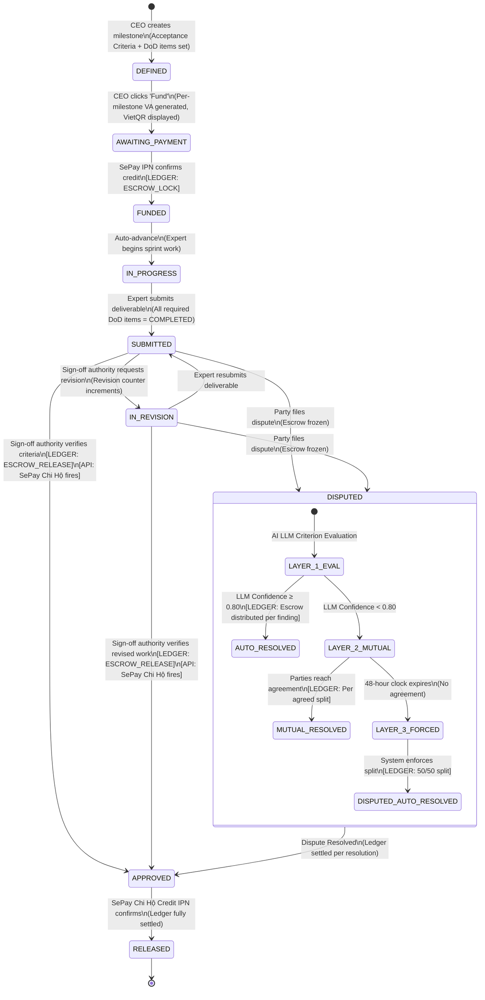

---

## Detailed Narration: Milestone State Machine

The Milestone state machine is the contractual and financial backbone of AITasker. It ensures that money only moves when specific structural conditions are met, and it handles the non-linear realities of AI consulting (revisions, disputes, scope evolution) without ever leaving the escrow unprotected.

### 1. Definition & Funding Phase

-   **`[*]` → `DEFINED`**
    -   **Trigger:** The CEO creates a milestone within an active engagement.
    -   **Logic:** The shell of the milestone is created. It must contain Acceptance Criteria (the payment contract), DoD items (the expert's self-check), and a sprint plan framework. No money has moved yet.
    -   **Context:** MF-7 Step [2].

-   **`DEFINED` → `AWAITING_PAYMENT`**
    -   **Trigger:** The CEO clicks "Fund Milestone".
    -   **Logic:** The system generates a dedicated, fixed-amount Virtual Account (VA) via the SePay API and displays a VietQR to the CEO. The milestone is now waiting for the specific bank transfer.
    -   **Context:** MF-7 Steps [3]–[4].

-   **`AWAITING_PAYMENT` → `FUNDED`**
    -   **Trigger:** SePay IPN webhook confirms a credit of the exact fixed amount to the milestone's VA.
    -   **Logic:** **[LEDGER: ESCROW_LOCK]** The system executes an atomic transaction: deducting the amount from the CEO's `available_balance` and adding it to their `locked_balance`. The escrow is now secured.
    -   **Context:** MF-7 Step [8].

### 2. Execution & Review Phase

-   **`FUNDED` → `IN_PROGRESS`**
    -   **Trigger:** System auto-advance.
    -   **Logic:** The money is confirmed; the expert is legally cleared to begin billable work. Sprint tracking becomes active.
    -   **Context:** MF-7 Step [8] (Auto-advances from FUNDED).

-   **`IN_PROGRESS` → `SUBMITTED`**
    -   **Trigger:** Expert clicks "Submit Deliverable".
    -   **Logic:** A strict backend guard verifies that *all* DoD items marked as `is_required = true` are in the `COMPLETED` state. If they aren't, the submission is rejected. Upon success, the review clock starts, signaling the CEO/Tech Team to evaluate the work against the Acceptance Criteria.
    -   **Context:** MF-7 Steps [13]–[14].

-   **`SUBMITTED` ↔ `IN_REVISION`**
    -   **Trigger (to IN_REVISION):** Sign-off authority (Tech Team or CEO) requests a criterion-referenced revision.
    -   **Trigger (back to SUBMITTED):** Expert updates the deliverable and resubmits.
    -   **Logic:** This loop handles the iterative nature of AI work. The revision counter increments, ensuring the loop cannot run indefinitely without escalation. The escrow remains locked.
    -   **Context:** Analogous to the Surface B bid revision loop, but applied to deliverables.

### 3. Dispute Phase (Composite State)

-   **`SUBMITTED` / `IN_REVISION` → `DISPUTED`**
    -   **Trigger:** Any party (Expert, CEO, or Tech team) files a formal dispute.
    -   **Logic:** The milestone state freezes. The `escrow_status` is set to `FROZEN`, preventing any automated release triggers even if someone tries to approve the milestone while the dispute is active.
    -   **Context:** MF-8 Steps [1]–[2].

    *Inside the `DISPUTED` composite state, the 3-Layer resolution protocol executes:*
    -   **Layer 1 (`LAYER_1_EVAL` → `AUTO_RESOLVED`):** The AI evaluates the evidence. If confidence ≥ 0.80, it auto-resolves. **[LEDGER]** fires based on the finding (either `ESCROW_RELEASE` to expert or `ESCROW_REFUND` to client).
    -   **Layer 2 (`LAYER_2_MUTUAL` → `MUTUAL_RESOLVED`):** If AI confidence is low, a 48-hour structured negotiation window opens. If both select the same option, it resolves. **[LEDGER]** fires based on the agreed split.
    -   **Layer 3 (`LAYER_3_FORCED` → `DISPUTED_AUTO_RESOLVED`):** If 48 hours expire with no agreement, the system forces a 50/50 split. **[LEDGER: ESCROW_SPLIT]** fires.

-   **`DISPUTED` → `APPROVED`**
    -   **Trigger:** Any of the three dispute resolution paths conclude.
    -   **Logic:** Crucially, regardless of who "won" the dispute, the milestone itself transitions to `APPROVED`. In AITasker's data model, `APPROVED` does *not* mean the expert's work was accepted; it means the **milestone's contractual lifecycle is closed and the ledger has been settled** (whether that settlement was a full release, a refund, or a split). This prevents the milestone from remaining in a zombie state.

### 4. Settlement Phase

-   **`SUBMITTED` / `IN_REVISION` → `APPROVED`** (Happy Path)
    -   **Trigger:** Sign-off authority verifies all required acceptance criteria.
    -   **Logic:** **[LEDGER: ESCROW_RELEASE]** The system executes the atomic ledger transaction: unlocking the client's funds, taking the 5% platform fee, and crediting the expert's `available_balance`. **[API]** Immediately after the ledger commits, the system fires the SePay Chi Hộ API to disburse the funds to the expert's linked bank account.
    -   **Context:** MF-7 Steps [17]–[18].

-   **`APPROVED` → `RELEASED`**
    -   **Trigger:** SePay Credit IPN confirms the chi hộ transfer landed in the expert's personal bank account.
    -   **Logic:** The final state. The financial pipeline is fully settled. The ledger is closed, and the money is physically in the expert's bank.
    -   **Context:** MF-7 Steps [20]–[21].

-   **`RELEASED` → `[*]`**
    -   The milestone lifecycle ends.


# State Diagram: Bid

Based strictly on Section 0.6 and the logical flows established in MF-6, here is the state diagram for the **Bid** entity. This state machine is uniquely non-linear, designed to facilitate structured push-back across three distinct "Surfaces" (Technical Revision, Price Negotiation, and CEO Override) without allowing infinite loops.

## Mermaid.js State Diagram

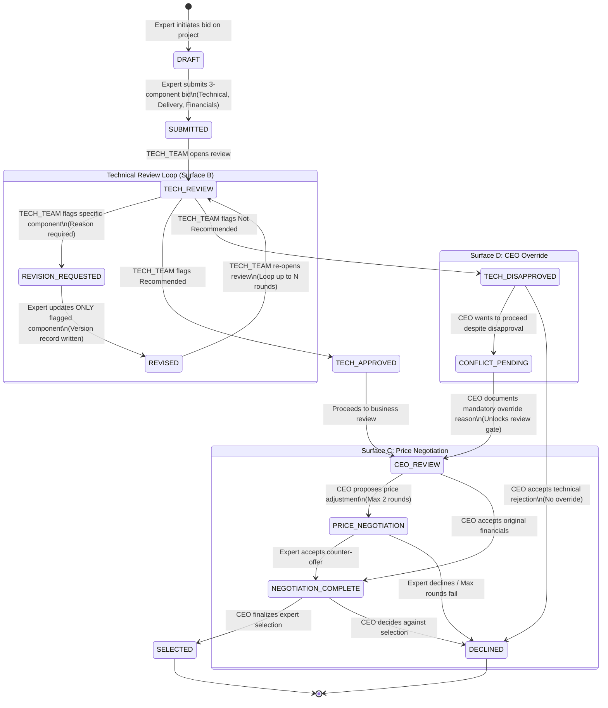

---

## Detailed Narration: Bid State Machine

The Bid state machine implements a structured, multi-stakeholder negotiation protocol. Unlike a simple "submit and accept" model, AITasker recognizes that AI consulting bids require technical validation separate from business approval, and that scope/pricing often needs bounded iteration. 

### 1. Submission & Technical Scrutiny (Surface B Loop)

-   **`[*]` → `DRAFT` → `SUBMITTED`**
    -   **Trigger:** The Expert constructs their bid and clicks submit.
    -   **Logic:** The Expert must submit a strict 3-component payload: Technical Approach, Delivery Plan, and Financials. The bid is versioned starting at v1.
    -   **Context:** MF-6 Steps [7]–[8].

-   **`SUBMITTED` → `TECH_REVIEW`**
    -   **Trigger:** The Client's TECH_TEAM opens the bid to evaluate the technical merits.
    -   **Logic:** Only the TECH_TEAM has the architectural authority to evaluate the Technical Approach. The CEO cannot access this review phase.
    -   **Context:** MF-6 Step [9].

-   **`TECH_REVIEW` ↔ `REVISION_REQUESTED` ↔ `REVISED` (The Loop)**
    -   **Trigger (to REVISION_REQUESTED):** TECH_TEAM identifies a flaw or gap in a specific component (e.g., "Technical Approach doesn't address the A↔C seam mitigation"). A reason is mandatory.
    -   **Trigger (to REVISED):** Expert updates *only* the flagged component. The unflagged components are locked for this version.
    -   **Trigger (back to TECH_REVIEW):** TECH_TEAM reviews the updated component.
    -   **Logic:** This is **Surface B**. It prevents the Expert from arbitrarily changing their price or timeline when

# State Diagram: Spec Clarification (Surface A)

Based strictly on Section 0.6 and the logical flows established in MF-6, here is the state diagram for the **Spec Clarification** entity. This state machine governs **Surface A**-the pre-bid push-back mechanism that allows experts to probe for missing information in Artifact A before committing to a 3-component bid.

## Mermaid.js State Diagram

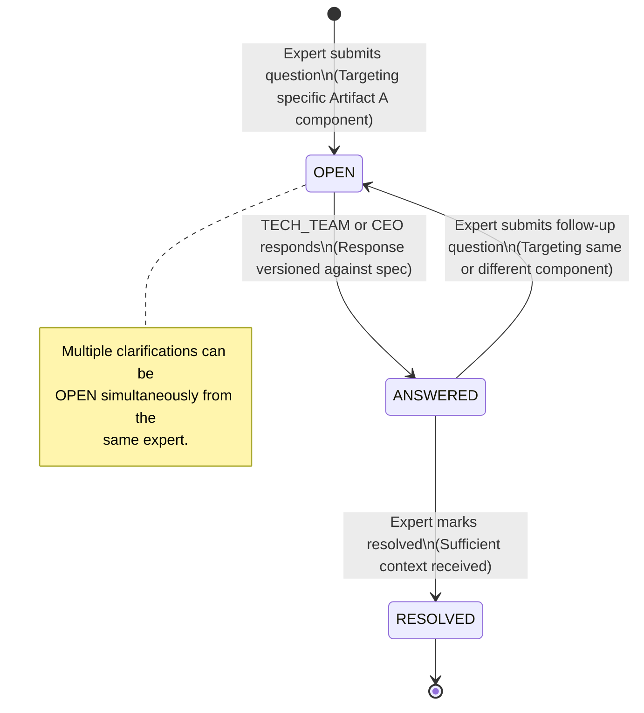

---

## Detailed Narration: Spec Clarification State Machine

The Spec Clarification state machine resolves the **information asymmetry** (the "proposal catch-22") inherent in AI consulting. Experts need architectural truth to scope accurately, but clients cannot expose proprietary IP until an expert is selected. Artifact A provides the sanitized public spec, but gaps inevitably remain. This state machine provides a structured, audit-trailed mechanism to fill those gaps without exposing Artifact B prematurely.

### 1. Initiation: Probing the Spec

-   **`[*]` → `OPEN`**
    -   **Trigger:** An Expert views a PUBLISHED Artifact A and identifies a missing critical detail (e.g., "What is the current error rate baseline for the compliance system?").
    -   **Logic:** The Expert submits a targeted question. The system creates a `spec_clarifications` record.
    -   **Constraints:** 
        -   This state is only accessible *pre-bid*. Once a bid is submitted, the Surface A channel closes for that expert; further push-back moves to Surface B (Bid Revision Loop).
        -   The question must target a specific component of Artifact A.
    -   **Concurrency:** Crucially, the system allows multiple `OPEN` clarifications simultaneously from the same expert. If an expert has 5 distinct gaps in the spec, they can open 5 separate clarification records in parallel rather than waiting for a sequential back-and-forth.
    -   **Context:** MF-6 Steps [1]–[3].

### 2. Response: Versioned Context Injection

-   **`OPEN` → `ANSWERED`**
    -   **Trigger:** The TECH_TEAM (or CEO, depending on project structure) provides the answer.
    -   **Logic:** The client side fills the information void.
    -   **Audit/Research Value:** The response is explicitly **versioned against the spec**. It does not silently alter Artifact A; instead, it becomes a linked addendum. This is critical for RQ2 research data-tracking how the understanding of the project scope evolves through dialogue before a contract is signed.
    -   **Context:** MF-6 Steps [4]–[5].

### 3. Resolution or Follow-up

-   **`ANSWERED` → `RESOLVED`**
    -   **Trigger:** The Expert is satisfied that the answer provides sufficient context to formulate a bid.
    -   **Logic:** The Expert explicitly marks the clarification as `RESOLVED`. This signals to the client that this specific information gap has been closed. The lifecycle of this specific clarification record ends here.
    -   **Context:** MF-6 Step [6].

-   **`ANSWERED` → `OPEN` (Follow-up / Re-opening)**
    -   **Trigger:** The Expert reviews the answer but finds it insufficient, or the answer reveals a new adjacent gap.
    -   **Logic:** While the spec defines a linear progression to `RESOLVED`, in practice, an answer might prompt a follow-up question. Rather than modifying the `ANSWERED` record, the Expert opens a *new* `OPEN` clarification referencing the previous one, or the system allows cycling back to `OPEN` if the answer misses the mark. *(Note: The most strictly grounded interpretation of Section 0.6 is that a resolved clarification allows opening a "new clarification," implying a new record. The diagram above shows the functional state cycle for a given topic of discussion).*
    -   **Outcome:** The iterative inquiry continues until the Expert has enough data to submit their 3-component bid, transitioning to the Bid state machine.

### Summary of Design Intent

This simple tri-state machine (`OPEN` → `ANSWERED` → `RESOLVED`) is deliberately lightweight. It prevents the platform from becoming a bottleneck where experts must gamble on blind bids. By formally capturing the Q&A process, AITasker ensures that:
1.  **IP is Protected:** The client doesn't have to expose Artifact B to get experts to bid.
2.  **Bids are Accurate:** Experts bid on factual architecture, not assumptions.
3.  **Spec Evolution is Tracked:** The RQ2 research goal is satisfied by maintaining a versioned history of how the spec was clarified through dialogue.


# State Diagram: Spec

Based strictly on Section 0.6 and the logical flows established in MF-4, here is the state diagram for the **Spec** entity. This state machine governs the lifecycle of a project's specification-from raw CEO intent to a public, matchable Artifact A. Its defining characteristic is the **automated quality gate**, which deliberately eliminates the need for manual admin approval.

## Mermaid.js State Diagram

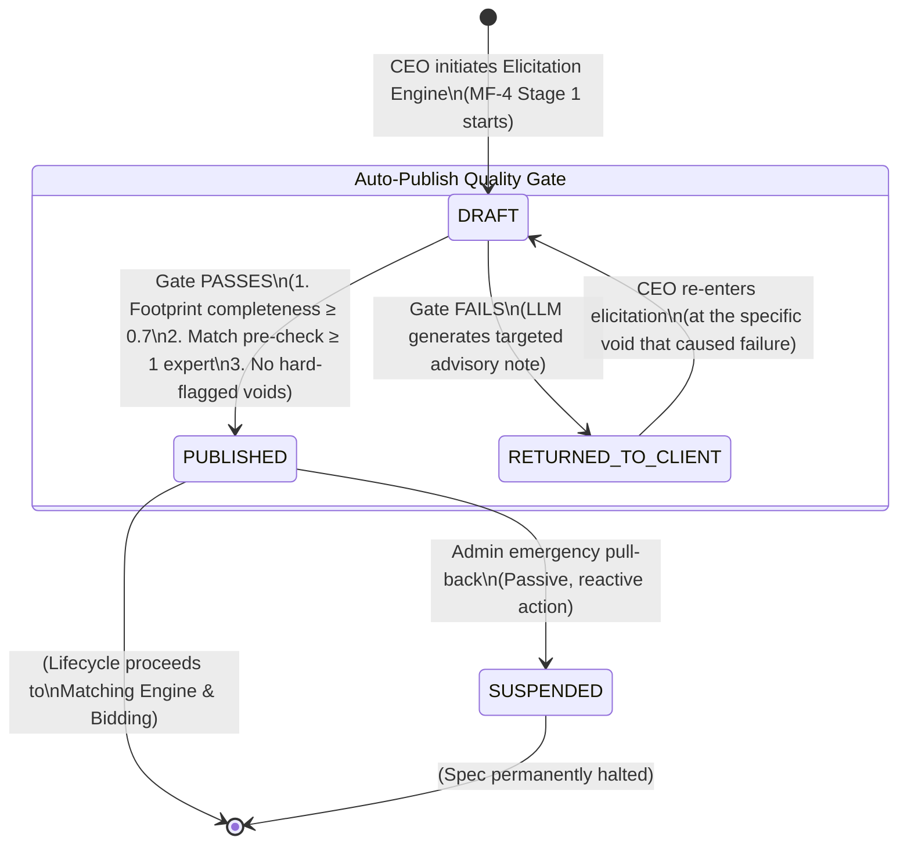

---

## Detailed Narration: Spec State Machine

The Spec state machine is the output of the AI Elicitation Engine (MF-4). It represents the transformation of a vague business symptom into a taxonomy-grounded, matchable capability footprint. The core design philosophy here is **automated structural integrity**: the system ensures a spec is viable before exposing it to experts, but it uses code and AI rather than human admins to enforce this.

### 1. Assembly Phase: The Draft

-   **`[*]` → `DRAFT`**
    -   **Trigger:** The CEO clicks "Start New AI Project" and enters the Elicitation Engine.
    -   **Logic:** The system creates a shell spec record. The `DRAFT` state encompasses the entire conversational assembly process-Stages 1 through 4 of the Elicitation Engine. The spec remains in `DRAFT` while the CEO inputs business pains, the AI injects SDLC components (like Phase 0), the CEO answers behavioral probes, and the Tech Team completes the architecture handoff.
    -   **Context:** MF-4 Steps [1]–[6].

### 2. The Automated Quality Gate

When the Elicitation Engine reaches Stage 5 (Synthesis), the system attempts to transition the spec out of `DRAFT`. This transition is guarded by an automated, three-point Quality Gate. **There is no admin exception queue.** A spec either meets the structural requirements to be matchable, or it is returned.

-   **`DRAFT` → `PUBLISHED` (Happy Path)**
    -   **Trigger:** The Auto-Publish Quality Gate passes all three checks.
    -   **Logic:**
        1.  **Footprint Completeness ≥ 0.7:** Mandatory injections (like Phase 0) are present, the required seam count meets the archetype minimum, and the SDLC framework is populated.
        2.  **Matching Pre-Check Passes:** At least 1 expert in the pool scores above the minimum match threshold. (Publishing a spec that literally zero experts can fulfill is a waste of the client's time).
        3.  **No Hard-Flagged Voids:** Critical missing information (e.g., a ground truth void acknowledged but Phase 0 not injected) is resolved.
    -   **Outcome:** Artifact A becomes publicly visible to matched experts. The Matching Engine (MF-5) is triggered automatically.
    -   **Context:** MF-4 Steps [27]–[29].

-   **`DRAFT` → `RETURNED_TO_CLIENT` (Failure Path)**
    -   **Trigger:** The Auto-Publish Quality Gate fails one or more checks.
    -   **Logic:** The system refuses to publish a broken spec. Instead of routing to an admin for manual review, the system uses the FastAPI LLM to generate a **targeted advisory note**. This note explains exactly *why* the spec failed and points to the specific data void.
    -   **Context:** MF-4 Steps [30]–[31].

-   **`RETURNED_TO_CLIENT` → `DRAFT` (The Correction Loop)**
    -   **Trigger:** The CEO re-enters the Elicitation Engine to fix the failure.
    -   **Logic:** Crucially, the CEO does *not* start from scratch. The system routes them directly back to the specific point in the elicitation flow that caused the failure (e.g., "You must accept the Phase 0 Ground Truth injection"). Once the void is filled, the spec re-enters `DRAFT` and the Quality Gate runs again.
    -   **Context:** MF-4 Step [31].

### 3. Post-Publication: Emergency Intervention

-   **`PUBLISHED` → `SUSPENDED`**
    -   **Trigger:** Admin executes an emergency pull-back.
    -   **Logic:** This is the **only** admin intervention in the spec lifecycle. It is passive and reactive, meaning admins do not pre-approve specs; they only pull them back *after* they are published if a critical issue is found (e.g., an expert reports that Artifact A contains accidentally exposed proprietary schema data, or the project is fundamentally flawed).
    -   **Outcome:** The spec is immediately hidden from the marketplace and matching engine.
    -   **Context:** MF-17 (Admin Integrity Monitor).

### Summary of Design Intent

The Spec state machine enforces a strict "quality at the source" methodology. By automating the publication gate and using LLM-generated advisory notes for failures, AITasker ensures that:
1.  **Experts aren't spammed:** They only see structurally sound, matchable projects.
2.  **Admins aren't bottlenecks:** The system scales without requiring human approval for every new project.
3.  **Clients are guided:** Instead of a blunt rejection, the system provides surgical feedback on exactly what information is missing to make their project viable.

# State Diagram: Engagement

Based strictly on Section 0.6 and the logical flows established in MF-6, MF-7, and MF-8, here is the state diagram for the **Engagement** entity. This state machine represents the overarching contractual relationship between the Client and the Expert-from the initial connection request to the final settlement of the project.

## Mermaid.js State Diagram

```mermaid
stateDiagram-v2
    direction TB

    [*] --> PENDING : CEO selects Expert & sends\nconnection request (MF-6)

    PENDING --> CONNECTED : Expert accepts request
    note right of CONNECTED
        Bank Hub link check runs;
        Artifact B released
    end note
    
    PENDING --> DECLINED : Expert rejects request
    note right of DECLINED
        Engagement terminated
    end note

    CONNECTED --> ACTIVE : First milestone funded\n(SePay IPN confirms ESCROW_LOCK)

    state "Active Engagement" as Active_Engagement {
        direction TB
        ACTIVE --> CLOSED : Final milestone RELEASED\n(All deliverables accepted;\nLedger fully settled)
        
        ACTIVE --> DISPUTED : Dispute filed on a milestone\n(Escrow frozen)
        
        DISPUTED --> ACTIVE : Dispute resolved
        note right of ACTIVE
            Escrow unfrozen/distributed;
            Work resumes if milestones remain
        end note
    }

    CLOSED --> [*]
    DECLINED --> [*]
```

---

## Detailed Narration: Engagement State Machine

The Engagement state machine is the macro-level container for a project-based or service-based relationship. While the **Milestone** state machine handles the micro-level escrow and deliverable reviews, the **Engagement** state machine governs the legal and relational boundary between the two parties. 

Its design ensures that sensitive IP (Artifact B) is never exposed prematurely, and that no billable work begins until financial commitment (escrow) is secured.

### 1. Initiation & Connection Phase

-   **`[*]` → `PENDING`**
    -   **Trigger:** The CEO clicks "Select Expert" on a finalized bid (or attempts to hire for a service).
    -   **Logic:** The system creates an `engagements` record. For Path A (Project-Based), this is the direct result of the Bid state machine reaching the `SELECTED` state. A connection request is dispatched to the Expert.
    -   **Context:** MF-6 Step [22].

-   **`PENDING` → `CONNECTED`**
    -   **Trigger:** The Expert accepts the connection request.
    -   **Logic:** This transition triggers two critical safety mechanisms:
        1.  **Bank Hub Link Check:** The system verifies `users.sepay_bank_account_xid IS NOT NULL` for the Expert. If they haven't linked a bank account (MF-2 Phase F), the transition to `CONNECTED` is blocked, preventing an engagement where the expert cannot be paid.
        2.  **State-Gated IP Release:** Upon successful connection, the system updates `artifacts.access_level` to `CONNECTED` for Artifact B. The Expert can now see the proprietary architecture and schema necessary to do the work.
    -   **Context:** MF-6 Steps [23]–[24].

-   **`PENDING` → `DECLINED`**
    -   **Trigger:** The Expert rejects the connection request.
    -   **Logic:** The engagement is terminated immediately. The CEO is notified and must return to the shortlist (MF-5) to select another expert.

### 2. Financial Commitment Phase

-   **`CONNECTED` → `ACTIVE`**
    -   **Trigger:** The CEO funds the *first* milestone. Specifically, when the SePay IPN confirms the escrow lock (Milestone state transitions from `AWAITING_PAYMENT` to `FUNDED`/`IN_PROGRESS`).
    -   **Logic:** This is the point of no return. An engagement is not considered `ACTIVE` (and the expert is not expected to perform billable work) until money is secured in escrow. For Path B (Service Purchase), the system transitions rapidly from creation directly to `ACTIVE` upon payment, skipping the `PENDING`/`CONNECTED` phases because there is no Artifact B to gate and no bid to accept.
    -   **Context:** MF-7 Step [8] or MF-10 Step [10].

### 3. Execution & Dispute Phase

-   **`ACTIVE` ↔ `DISPUTED`**
    -   **Trigger (to DISPUTED):** Any party files a dispute on an active milestone.
    -   **Trigger (back to ACTIVE):** The dispute is resolved (via Layer 1, 2, or 3).
    -   **Logic:** While the precise financial settlement happens at the Milestone level, the Engagement state reflects the relational breakdown. An engagement in `DISPUTED` status signals a contractual freeze. If the dispute is resolved but milestones remain, the engagement returns to `ACTIVE` so work can resume.
    -   **Context:** MF-8 Steps [2], [10], [15], or [16].

### 4. Conclusion Phase

-   **`ACTIVE` → `CLOSED`**
    -   **Trigger:** The final milestone in the engagement reaches the `RELEASED` state (SePay chi hộ IPN confirms final payout).
    -   **Logic:** All contractual obligations have been met, all deliverables accepted, and all ledger entries settled. The engagement is permanently closed. This also triggers the post-engagement evaluation pipeline (MF-16 Expert Verification Auto-Upgrade).
    -   **Context:** MF-7 Step [21] / MF-12 Step [17].

### Summary of Design Intent

The Engagement state machine enforces AITasker's core trust mechanisms:
1.  **Information Asymmetry Resolution:** The `PENDING` → `CONNECTED` transition gates Artifact B, ensuring experts only see proprietary data after formally accepting the project.
2.  **No Free Work:** The `CONNECTED` → `ACTIVE` transition gates the start of work on financial commitment (escrow funding).
3.  **Macro/Micro Separation:** By keeping the Engagement state separate from the Milestone state, a dispute on a single milestone (micro) doesn't legally terminate the entire engagement (macro), allowing projects to survive and resume after localized conflicts are resolved.


# State Diagram: Engagement Type (Immutable Classifier)

Based strictly on Section 0.6 and the logical flows established in MF-4, MF-6, and MF-10, here is the diagram for the **Engagement Type**. 

Unlike the previous diagrams, this is **not a state machine with transitions**. The document explicitly states that the Engagement type is *"set at creation; immutable."* An engagement cannot morph from a service purchase into a project-based engagement mid-flight; their structural, financial, and RBAC foundations are entirely different.

Instead, this diagram models the **Engagement Type as a discriminator** that dictates which specific lifecycle path an instance will follow from creation to closure.

## Mermaid.js Diagram

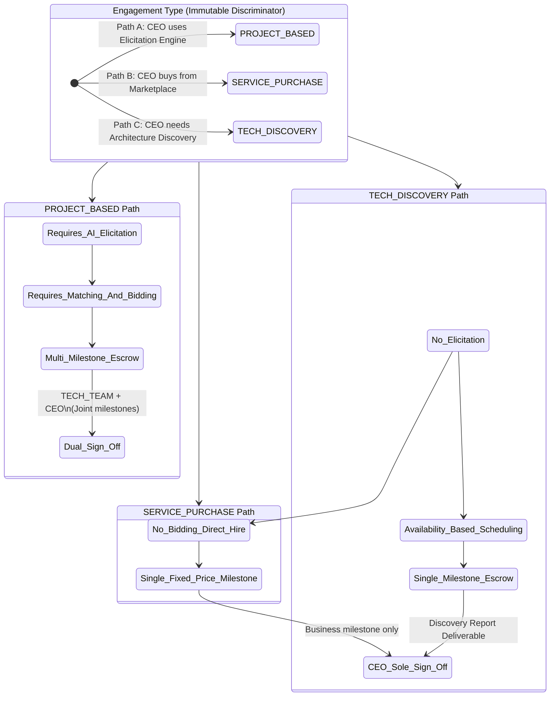

---

## Detailed Narration: Engagement Types

The Engagement Type is the architectural keystone that determines which features, state machines, and RBAC rules apply to a client-expert relationship. By making it immutable at creation, AITasker prevents structural contradictions-like trying to apply a multi-milestone escrow dispute to a simple, fixed-price marketplace purchase.

### 1. PROJECT_BASED (Path A: The Core Innovation)

This is the most complex engagement type, utilizing the full depth of the AITasker platform to solve the structural failures of AI consulting.

-   **Creation Trigger:** The CEO completes the AI Elicitation Engine (MF-4) and the resulting spec is `PUBLISHED`.
-   **Structural Requirements:**
    -   **Full Elicitation:** Requires a Capability Footprint, Artifact A (public), and Artifact B (state-gated).
    -   **Matching & Bidding:** Must go through the Composite Scoring engine (MF-5) and the non-linear Bid system (Surfaces A, B, C, D) (MF-6).
    -   **Multi-Milestone Escrow:** The work is broken down into multiple milestones (including the mandatory Phase 0 if injected). Each milestone has its own independent state machine (FUNDED → IN_PROGRESS → APPROVED).
    -   **Dual Sign-off Authority:** Because the scope is complex and technical, milestones can be of type `JOINT` or `TECHNICAL`, requiring sign-off from the TECH_TEAM before the CEO releases funds.
-   **Context:** MF-4, MF-5, MF-6, MF-7, MF-8.

### 2. SERVICE_PURCHASE (Path B: The Marketplace Flow)

This is a streamlined, transactional flow for pre-packaged AI services where the scope is already well-defined by the Expert.

-   **Creation Trigger:** The CEO clicks "Buy Now" on an Expert's published service listing in the marketplace (MF-10).
-   **Structural Requirements:**
    -   **No Elicitation:** The spec is the service description itself. No Capability Footprint is generated.
    -   **No Bidding:** The Expert sets the price and timeline. There is no Surface A/B/C/D negotiation.
    -   **Single Fixed-Price Milestone:** The system automatically creates one milestone with the exact amount defined in the service listing. There is no scope evolution (MF-14 Add-On Protocol is disabled for this type).
    -   **CEO Sole Sign-off:** The milestone is strictly a `BUSINESS` type. The CEO is the only sign-off authority. No TECH_TEAM is involved or required.
-   **Context:** MF-9, MF-10.

### 3. TECH_DISCOVERY (Path C: The Exploratory Flow)

This is a specialized engagement type designed for Scenario A from MF-4-where a CEO has no technical team and needs an expert to map out the architecture before committing to a full build.

-   **Creation Trigger:** 
    -   Option 1: The Elicitation Engine hard-blocks the CEO (Stage 4 unreachable) and they choose to buy a Tech Discovery session instead of generating a handoff link.
    -   Option 2: The CEO buys a TECH_DISCOVERY service directly from the marketplace.
-   **Structural Requirements:**
    -   **No Elicitation:** Similar to Service Purchase, there is no deep diagnostic engine run.
    -   **Availability-Based:** The expert must confirm their availability for the session before the funding phase begins.
    -   **Single Milestone:** The deliverable is a discovery report (architecture mapping, feasibility study, ground truth assessment), not a working production system.
    -   **CEO Sole Sign-off:** The CEO reviews the report and approves the payment.
-   **Strategic Purpose:** This engagement type acts as a structured on-ramp. The output of this engagement (the discovery report) provides the technical truth necessary to later create a **PROJECT_BASED** engagement with proper Artifact B population.

### Summary of Design Intent

By strictly separating these three types and making them immutable, AITasker achieves:
1.  **Predictable Escrow Logic:** A dispute on a `SERVICE_PURCHASE` is simple (did you deliver the service yes/no?). A dispute on a `PROJECT_BASED` milestone requires criterion-referenced evaluation (MF-8). The system needs to know which logic tree to climb.
2.  **RBAC Enforcement:** `PROJECT_BASED` engagements invoke the TECH_TEAM role; the others do not.
3.  **Feature Gating:** The Add-On Phase Protocol (MF-14) and Spec Clarifications (Surface A) are structurally impossible in `SERVICE_PURCHASE` because the state machines for those features require a project footprint and a bid, which this type lacks.

# State Diagram: Sprint Status

Based strictly on Section 0.6 and the logical flows established in MF-7 and MF-14, here is the state diagram for the **Sprint Status**. This state machine operates inside an `IN_PROGRESS` milestone. Unlike the Milestone or Bid state machines, the Sprint Status machine is purely for **transparency and progress tracking**-it has no direct impact on escrow or payment. 

Its most critical function is detecting **SCOPE_EVOLUTION**, which automatically triggers the structural intervention of the Add-On Phase Protocol (MF-14).

## Mermaid.js State Diagram

```mermaid
stateDiagram-v2
    direction TB

    [*] --> ON_TRACK : Expert submits weekly update\n(Work aligns with sprint plan)

    ON_TRACK --> DEVIATION : Expert reports deviation\n(Provides adjusted timeline;\nMilestone review clock UNCHANGED)

    DEVIATION --> ON_TRACK : Work realigns with plan\nor adjusted timeline accepted

    ON_TRACK --> BLOCKER : Expert reports blocker\n(Milestone review clock PAUSED)
    DEVIATION --> BLOCKER : Expert reports blocker\n(Milestone review clock PAUSED)

    state BLOCKER {
        direction TB
        
        state "Standard Blockers" as Standard_Blocker
            [*] --> Standard_Blocker : blocker_type = SCOPE_GAP |\nTECH_CONSTRAINT |\nEXTERNAL_DEPENDENCY
            Standard_Blocker --> Resolved : TECH_TEAM intervenes &\nmarks resolved

        state "Scope Evolution" as Evolution_Blocker
            [*] --> Evolution_Blocker : blocker_type = SCOPE_EVOLUTION
            Evolution_Blocker --> Resolved : F8 Add-On Phase Protocol\ncompletes (MF-14)
    }

    Resolved --> ON_TRACK : Blocker cleared\n(Milestone review clock RESUMES)
    
    ON_TRACK --> [*] : Sprint concludes\n(Next sprint starts or\nMilestone is submitted)
```

---

## Detailed Narration: Sprint Status State Machine

The Sprint state machine acknowledges a fundamental truth in AI consulting: **work rarely goes exactly according to plan**. Rather than penalizing experts for deviations or forcing them to hide blockers to avoid contract breaches, AITasker provides a structured mechanism for reporting reality. 

By decoupling sprint status from payment (escrow), the system encourages honest reporting, which in turn allows the platform to react structurally-especially when scope evolution occurs.

### 1. The Happy Path: On Track

-   **`[*]` → `ON_TRACK`**
    -   **Trigger:** The Expert submits their weekly sprint update indicating that work is proceeding according to the agreed sprint plan.
    -   **Logic:** The system acknowledges the update. No notifications are sent to the client other than a routine progress log entry. The milestone review clock (the timeframe the expert has to submit the deliverable) continues ticking normally.
    -   **Context:** MF-7 Step [9].

### 2. The Minor Disruption: Deviation

-   **`ON_TRACK` → `DEVIATION`**
    -   **Trigger:** The Expert reports that work is slightly off-course (e.g., a library integration took a day longer than expected, or a non-critical feature needs rethinking).
    -   **Logic:** The client is notified, and the Expert must provide an adjusted timeline or explanation. Crucially, **the milestone review clock is unchanged**. A deviation is considered a manageable risk within the existing scope and budget. The expert absorbs the time variance.
    -   **Recovery:** The work either realigns with the original plan, or the client accepts the minor adjusted timeline, returning the sprint to `ON_TRACK`.

### 3. The Major Disruption: Blocker (Clock Paused)

-   **`ON_TRACK` / `DEVIATION` → `BLOCKER`**
    -   **Trigger:** The Expert reports that work cannot proceed without external intervention or a fundamental change to the project contract.
    -   **Logic:** The system immediately **pauses the milestone review clock**. The expert is not penalized for delays caused by factors outside their control while the blocker is active. The system then branches based on the specific `blocker_type`.

#### Branch A: Standard Blockers (External/Technical/Informational)
-   **Types:** `SCOPE_GAP` (missing information from the client), `TECH_CONSTRAINT` (infrastructure limitation), `EXTERNAL_DEPENDENCY` (third-party API down).
-   **Resolution Path:** The TECH_TEAM is notified. They must intervene (e.g., provide the missing schema, upgrade the server, or fix the API). Once the TECH_TEAM marks the issue resolved, the sprint transitions back to `ON_TRACK`, and the **milestone clock resumes**.

#### Branch B: Scope Evolution (The F8 Trigger)
-   **Type:** `SCOPE_EVOLUTION`.
-   **The Problem:** The Expert discovers that the reality of the production system requires work *outside* the defined acceptance criteria of the current milestone (e.g., "The spec assumed direct DB access, but it's a read-only replica; we need to build a sync layer").
-   **Resolution Path:** This is not a simple fix. In traditional platforms, this causes contract disputes. In AITasker, this is a **designed lifecycle event**. 
    -   Triggering `SCOPE_EVOLUTION` automatically launches the **F8 Add-On Phase Protocol (MF-14)**.
    -   The sprint remains in a `BLOCKER` state while the Expert proposes a causal chain, technical justification, and budget/timeline impact.
    -   The sprint only exits the `BLOCKER` state (returning to `ON_TRACK` and resuming the clock) when the Add-On Protocol reaches a final resolution (Approved: new milestone appended; or Rejected: original scope enforced).
-   **Context:** MF-14 Steps [1]–[2].

### Summary of Design Intent

The Sprint Status state machine enforces the RQ3 (Trust) and RQ2 (AI assists scope definition) research objectives:
1.  **Honesty without Penalty:** By pausing the clock for `BLOCKER` states, experts are incentivized to report problems immediately rather than hiding them until the deadline.
2.  **Structured Scope Evolution:** The `SCOPE_EVOLUTION` blocker type is the most innovative aspect. It prevents the "scope creep vs. contract violation" binary by treating structural changes as a formal, billable extension (MF-14) triggered automatically by the tracking system.
3.  **Decoupling from Payment:** Because sprints are weekly and do not trigger escrow releases, the client is never charged blindly for stalled work; the escrow only moves when the milestone-level state machine reaches `APPROVED`.

# State Diagram: DoD Checklist Item

Based strictly on Section 0.6 and the logical flows established in MF-7, here is the state diagram for the **DoD (Definition of Done) Checklist Item** entity. This is a micro-level state machine that operates inside an `IN_PROGRESS` milestone. While Acceptance Criteria act as the macro-level payment contract, DoD items act as the Expert's structural self-check before a deliverable can be submitted.

## Mermaid.js State Diagram

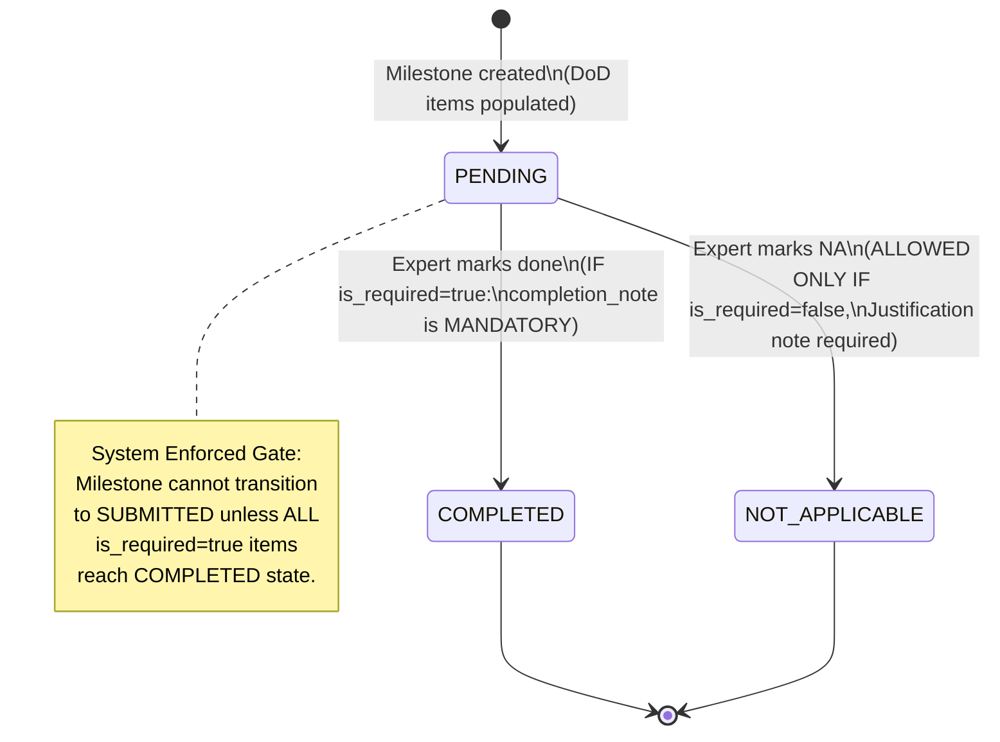

---

## Detailed Narration: DoD Checklist Item State Machine

The DoD Checklist Item state machine enforces **quality at the source**. In traditional freelance platforms, experts submit deliverables and clients discover missing elements during review, leading to the `IN_REVISION` loop or disputes. AITasker forces the Expert to explicitly verify structural completeness *before* the system even allows the submission button to be clicked.

### 1. The Default State: Awaiting Work

-   **`[*]` → `PENDING`**
    -   **Trigger:** The CEO creates a milestone and defines the DoD checklist items (alongside Acceptance Criteria).
    -   **Logic:** Every DoD item starts as `PENDING`. At creation, each item is flagged with a boolean `is_required` attribute. This flag fundamentally dictates which transition paths are legally available to the Expert later on.
    -   **Context:** MF-7 Steps [1]–[2].

### 2. The Successful Path: Completion

-   **`PENDING` → `COMPLETED`**
    -   **Trigger:** The Expert finishes the work associated with the checklist item (e.g., writing unit tests, deploying to staging).
    -   **Logic:** The Expert checks the box.
    -   **Conditional Constraint (The `is_required` flag):**
        -   **If `is_required = true`:** The Expert **must** provide a `completion_note` to transition to `COMPLETED`. This prevents rubber-stamping. For example, if the item is "Unit tests for decision engine," the expert must write a note like "90% coverage achieved, edge cases for HITL loop included."
        -   **If `is_required = false`:** The `completion_note` is optional.
    -   **Context:** MF-7 Step [11].

### 3. The Exclusion Path: Not Applicable

-   **`PENDING` → `NOT_APPLICABLE`**
    -   **Trigger:** The Expert determines the checklist item is irrelevant to the final deliverable (e.g., "API Documentation" when the team decided to use auto-generated Swagger docs instead).
    -   **Logic:** The Expert marks it NA.
    -   **Strict RBAC Constraint:** This transition is **hard-blocked by the system if `is_required = true`**. You cannot mark a mandatory security audit or a mandatory ground-truth baseline as "Not Applicable." If the item is required, it *must* go to `COMPLETED`. If the Expert truly believes a required item is unnecessary, they must initiate a conversation with the TECH_TEAM to have the CEO edit the milestone definition and flip the `is_required` flag to false.
    -   **Justification Required:** Even for non-required items, the Expert must provide a `note` explaining why it was excluded (e.g., "Replaced by auto-generated Swagger"). This maintains audit integrity.
    -   **Context:** MF-7 Step [11].

### 4. The System Guard: The Submission Gate

While not a state transition within the DoD machine itself, the most important aspect of this state machine is how it **dictates the parent Milestone state machine**.

-   **The Guard:** When the Expert clicks "Submit Deliverable" (attempting to transition the Milestone from `IN_PROGRESS` to `SUBMITTED`), the NestJS backend executes a strict validation query:
    ```sql
    SELECT COUNT(*) FROM dod_checklist_items 
    WHERE milestone_id = ? AND is_required = true AND state != 'COMPLETED'
    ```
-   **The Outcome:** If that query returns `> 0`, the submission is rejected with a `403 REQUIRED_DOD_INCOMPLETE` error. The Milestone *cannot* leave the `IN_PROGRESS` state until every single required DoD item has been explicitly resolved as `COMPLETED`.
-   **Context:** MF-7 Step [13].

### Summary of Design Intent

The DoD state machine solves a specific trust failure in AI consulting: **vague deliverables**. By forcing a granular, binary (or NA) resolution of predefined quality checks *before* submission, AITasker ensures that:
1.  **Experts self-police:** They cannot submit a half-finished deliverable hoping the client won't notice.
2.  **Revisions are minimized:** Because the structural baseline is verified upfront, the `IN_REVISION` loop is reserved for genuine misalignments in *how* the work was done, not *whether* specific components were forgotten.
3.  **Disputes are defensible:** If a dispute reaches MF-8 (Layer 1 LLM Evaluation), the system has an immutable record of the Expert certifying that required DoD items were completed, complete with timestamped notes.

# State Diagram: Internal Ledger Flow (Wallet Transaction Types)

Based strictly on Section 0.6 and the logical flows established in MF-7, MF-8, MF-11, MF-12, and MF-13, here is the diagram for the **Wallet Transaction Types**. 

Unlike previous diagrams, this is not a state machine for a single entity with sequential lifecycles. Instead, it models the **flow of value within the internal double-entry ledger**. The "states" here represent the distinct logical buckets where value resides, and the "transitions" are the specific, immutable transaction types that move value between these buckets. 

This architecture ensures that **no money ever moves without an explicit, auditable ledger reason**, and the system balances to absolute zero at all times.

## Mermaid.js Flow Diagram

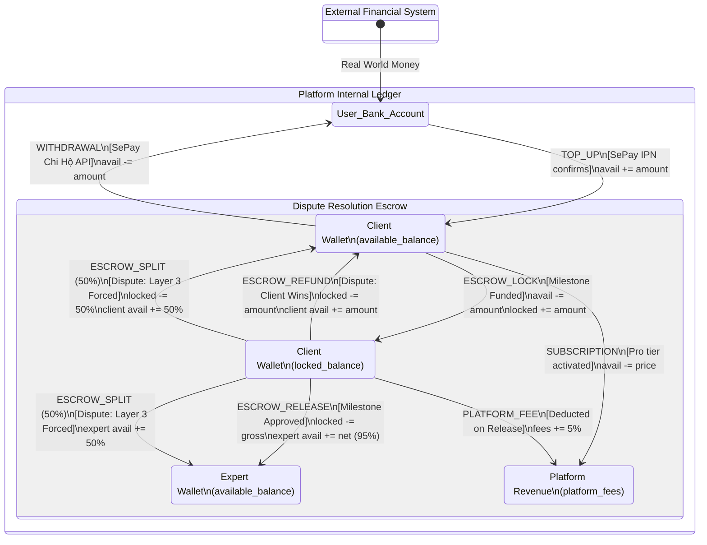

---

## Detailed Narration: Internal Ledger Flows

The wallet system is designed around a strict **double-entry bookkeeping** principle. Every transaction type is an atomic event that modifies two or more balance columns simultaneously. Because the platform operates as a closed-loop ledger (only interacting with the outside world via SePay VA top-ups and Chi Hộ withdrawals), it can guarantee financial integrity with **zero admin intervention**.

### 1. Inbound & Outbound Capital

These transitions handle the movement of real-world money into and out of the platform's internal ecosystem.

-   **`TOP_UP`** (External → Available)
    -   **Trigger:** SePay IPN confirms a bank transfer to a user's Virtual Account.
    -   **Logic:** `wallets.available_balance += amount`.
    -   **Design Intent:** This is the only way fiat currency enters the closed-loop system. Once credited, the value exists purely as database ledger entries until withdrawn. 
    -   **Context:** MF-11 Step [11].

-   **`WITHDRAWAL`** (Available → External)
    -   **Trigger:** Expert requests a cash-out.
    -   **Logic:** `wallets.available_balance -= amount`. (This atomic debit happens *before* the external Chi Hộ API call to prevent double-spend. If the API fails, a reversal ledger entry is written).
    -   **Design Intent:** Experts can access their earnings seamlessly. The ledger deducts immediately, ensuring the available balance accurately reflects spendable funds.
    -   **Context:** MF-12 Step [4].

### 2. Internal Consumption

This transition handles the consumption of internal value for platform services, never touching external bank APIs.

-   **`SUBSCRIPTION`** (Available → Platform Revenue)
    -   **Trigger:** User activates Client Pro or Expert Pro.
    -   **Logic:** `wallets.available_balance -= price`.
    -   **Design Intent:** Because the real money was already deposited via `TOP_UP`, the subscription purchase is a pure internal ledger reclassification. No external payment gateway fees are incurred here, maximizing platform margin.
    -   **Context:** MF-13 Step [5].

### 3. The Escrow Lifecycle (The Core Trust Mechanism)

These transitions govern the secure holding and conditional release of funds tied to project deliverables. They operate strictly on the Client's `locked_balance` to ensure funds are committed but not released until verified.

-   **`ESCROW_LOCK`** (Client Available → Client Locked)
    -   **Trigger:** CEO funds a milestone (SePay IPN confirms).
    -   **Logic:** `client.available_balance -= amount`; `client.locked_balance += amount`.
    -   **Design Intent:** The client commits the budget, proving they have the funds. The expert sees the milestone as "FUNDED," building trust that their work will be payable. However, the expert cannot access the money yet, protecting the client from unverified claims.
    -   **Context:** MF-7 Step [8].

-   **`ESCROW_RELEASE`** (Client Locked → Expert Available + Platform Revenue)
    -   **Trigger:** Sign-off authority approves the milestone deliverable (or AI/Human dispute resolution favors the expert).
    -   **Logic:** `client.locked_balance -= gross_amount`; `expert.available_balance += net_amount (95%)`; `platform_fees += fee (5%)`.
    -   **Design Intent:** The happy path. The platform takes its cut automatically at the moment of success, ensuring the revenue model is strictly tied to value delivery. The expert's available balance increases, allowing them to initiate a `WITHDRAWAL`.
    -   **Context:** MF-7 Step [18], MF-8 Step [10].

-   **`PLATFORM_FEE`** (Deduction on Release)
    -   **Trigger:** Automatically fires as part of the `ESCROW_RELEASE` atomic transaction.
    -   **Logic:** `platform_fees.balance += gross_amount * 0.05`.
    -   **Design Intent:** The 5% fee is never a separate transaction the user has to initiate; it is structurally embedded in the release logic, making it impossible to bypass.

### 4. Dispute Resolutions (Exception Flows)

When the happy path fails, these transitions unlock the escrow based on the outcome of the 3-Layer Dispute Protocol (MF-8).

-   **`ESCROW_REFUND`** (Client Locked → Client Available)
    -   **Trigger:** Dispute resolved in favor of the Client (e.g., deliverable fundamentally failed, L1 AI judged criterion not met).
    -   **Logic:** `client.locked_balance -= amount`; `client.available_balance += amount`. No platform fee is taken; the platform does not profit from failed projects.
    -   **Context:** MF-8 Step [10] (Path A, Client wins).

-   **`ESCROW_SPLIT`** (Client Locked → Client Available + Expert Available)
    -   **Trigger:** Layer 3 Forced Resolution (48 hours expire with no mutual agreement).
    -   **Logic:** `client.locked_balance -= amount`; `client.available_balance += amount/2`; `expert.available_balance += amount/2`.
    -   **Design Intent:** The structural failsafe. By automatically splitting the funds 50/50, the system guarantees finality to a deadlock without requiring an admin judge. No platform fee is typically applied to forced splits.
    -   **Context:** MF-8 Step [16] (Path D).

### Summary of Design Intent

The Wallet Transaction Types are the DNA of the platform's trust model. By mapping every possible movement of value to a specific, named transaction type:
1.  **Absolute Auditability:** Every VND can be traced from `TOP_UP` through `ESCROW_LOCK` to `ESCROW_RELEASE` and finally `WITHDRAWAL`. The `platform_decisions` and `wallet_transactions` tables provide a flawless forensic trail.
2.  **Zero Admin Financials:** Because the logic is encoded in these transaction types (e.g., the 5% fee is structurally deducted on release, splits are calculated automatically), no human admin ever has to manually move money or approve payouts.
3.  **Double-Entry Integrity:** The system never creates or destroys value internally; it only moves it between `available`, `locked`, and `fees`, ensuring the global ledger always balances to zero.

# State Diagram: Withdrawal

Based strictly on Section 0.6 and the logical flows established in MF-12, here is the state diagram for the **Withdrawal** entity. This state machine governs the outbound flow of funds from the platform's internal ledger to the Expert's real-world bank account via the SePay Chi Hộ API. 

Its defining characteristic is the **"debit-first, disburse-second"** pattern, which prevents double-spend while guaranteeing ledger integrity even when external APIs fail.

## Mermaid.js State Diagram

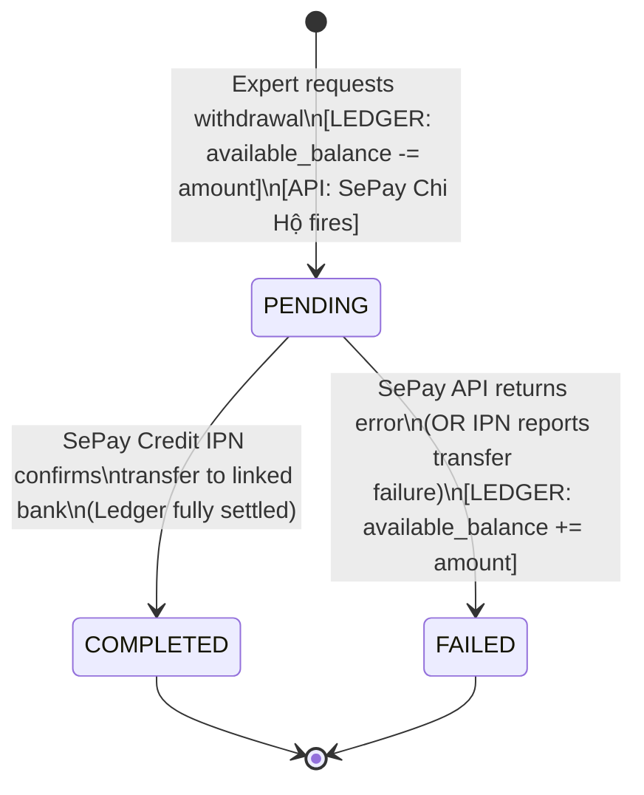

---

## Detailed Narration: Withdrawal State Machine

The Withdrawal state machine bridges the gap between AITasker's internal double-entry ledger and the real-world banking system. Because it handles real money leaving the platform, it is designed with a strong bias toward **safety and idempotency**-ensuring that an Expert can never withdraw more than their balance, and that API failures never result in lost funds.

### 1. Initiation: The Secured Pending State

-   **`[*]` → `PENDING`**
    -   **Trigger:** The Expert clicks "Withdraw Funds" and submits the amount.
    -   **Logic (The Debit-First Pattern):** Before the system even calls the external SePay API, it executes an atomic database transaction:
        1.  **Debit Wallet:** `wallets.available_balance -= amount`
        2.  **Ledger Entry:** `INSERT INTO wallet_transactions (type: 'WITHDRAWAL', amount: -amount)`
        3.  **Create Request:** `INSERT INTO withdrawal_requests (state: 'PENDING')`
    -   **Why Debit First?** If the system checked the balance, called the API, and *then* debited the wallet, a race condition could occur. The Expert could click "Withdraw" twice rapidly, both requests could pass the balance check, and double the intended amount could be dispatched. By deducting the balance *atomically* before the API call, the system guarantees the available balance is strictly enforced.
    -   **The API Call `[API]`:** Once the ledger is secured, the system fires the `POST SePay Chi Hộ API` with the Expert's `bank_account_xid` and the amount. The withdrawal is now `PENDING` the real-world banking outcome.
    -   **Context:** MF-12 Steps [3]–[5].

### 2. The Happy Path: Settlement

-   **`PENDING` → `COMPLETED`**
    -   **Trigger:** The SePay Credit IPN webhook fires, confirming that the money has successfully landed in the Expert's linked personal bank account.
    -   **Logic:** The system matches the IPN reference to the `withdrawal_requests` record and updates the state. The ledger was already settled in the `PENDING` step (the money left the wallet), so no further ledger modifications are needed. The lifecycle ends securely.
    -   **Context:** MF-12 Steps [8]–[10].

### 3. The Exception Path: Failure Reversal

-   **`PENDING` → `FAILED`**
    -   **Trigger:** The external banking process fails. This can happen in two ways:
        1.  **Synchronous API Error:** The SePay Chi Hộ API immediately returns a 4xx/5xx error (e.g., "Invalid bank_account_xid", "Bank account closed").
        2.  **Asynchronous IPN Failure:** The API initially accepts the request, but later a SePay IPN reports the transfer bounced.
    -   **Logic (The Atomic Reversal):** Because the system already debited the Expert's wallet in the `PENDING` state, a failure means the money left the ledger but never reached the bank. The system must immediately restore the funds via an atomic transaction:
        1.  **Credit Wallet Back:** `wallets.available_balance += amount`
        2.  **Reversal Ledger Entry:** `INSERT INTO wallet_transactions (type: 'WITHDRAWAL_FAILED', amount: +amount)`
        3.  **Update Request:** `UPDATE withdrawal_requests SET state = 'FAILED'`
    -   **Design Intent:** This guarantees that funds are never trapped in limbo. If the payout fails, the internal ledger is instantly rolled back to its pre-withdrawal state. The Expert is notified of the failure and the reason, and their available balance is immediately usable again.
    -   **Context:** MF-12 Steps [12]–[13].

### Summary of Design Intent

The Withdrawal state machine enforces a strict **zero-liability** model for the platform:
1.  **No Double-Spend:** The immediate debit in the `PENDING` state ensures that an Expert's available balance is always accurate and cannot be spent twice while a bank transfer is in flight.
2.  **Guaranteed Reversal:** The `FAILED` state with its mandatory ledger reversal ensures that external banking failures never result in lost funds or stuck balances. The internal ledger remains the single source of truth.
3.  **Zero Admin Intervention:** By automating the IPN listening, state matching, and reversal logic, the system handles the entire lifecycle-from request to settlement or failure-without a human finance team.

# State Diagram: Subscription

Based strictly on Section 0.6 and the logical flows established in MF-1, MF-2, and MF-13, here is the state diagram for the **Subscription** entity. This state machine governs the user's access to gated, high-value platform features (like the AI Elicitation Engine, Matching, and Tier 2+ bidding). 

Its most critical design feature is the **Grace Period** logic: an expired subscription blocks *new* AI feature usage, but never locks a user out of their *active*, in-progress engagements.

## Mermaid.js State Diagram

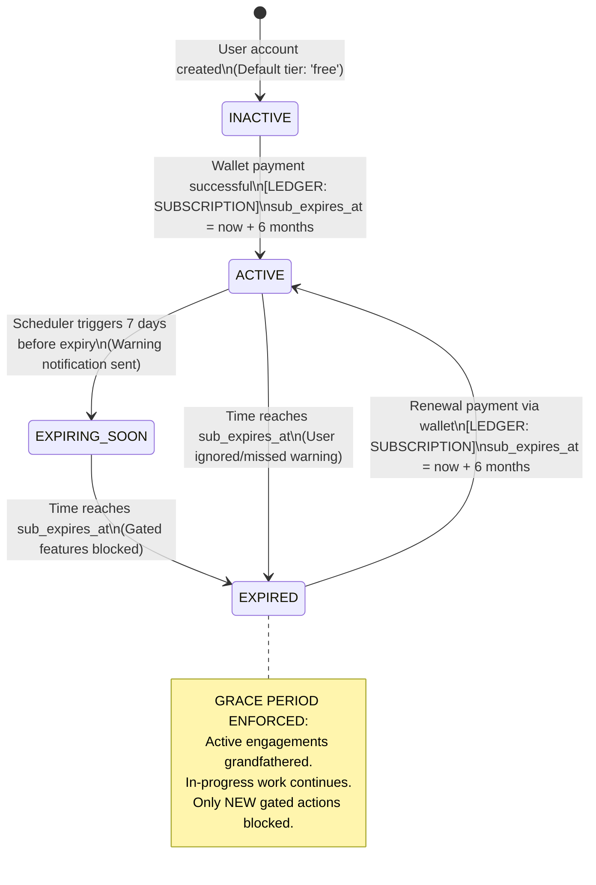

---

## Detailed Narration: Subscription State Machine

The Subscription state machine is the access control layer for the platform's AI infrastructure. Running LLMs and matching algorithms is expensive; the subscription model ensures users have skin in the game before consuming these resources, while the state machine ensures that the expiry of a digital pass never destroys the integrity of ongoing, real-world contracts.

### 1. The Default State: Free Tier

-   **`[*]` → `INACTIVE`**
    -   **Trigger:** A new user (Client or Expert) registers.
    -   **Logic:** The `users.subscription_client_tier` or `subscription_expert_tier` is set to `'free'`, and `sub_expires_at` is `NULL`. The user can browse the marketplace and view public data, but any route calling FastAPI (LLM features) or the matching engine will be intercepted by the Subscription Guard and return `403 SUBSCRIPTION_REQUIRED`.
    -   **Context:** MF-1 Step [9], MF-2 Step [6].

### 2. The Active State: Pro Unlocked

-   **`INACTIVE` → `ACTIVE`**
    -   **Trigger:** The user purchases the Pro tier via the internal wallet.
    -   **Logic:** The system executes the atomic ledger transaction (`available_balance -= price`), sets the tier to `'pro'`, and calculates `sub_expires_at = now() + 6 months`. The NestJS middleware immediately allows access to gated endpoints, and the frontend removes the "Upgrade" banners.
    -   **Context:** MF-13 Steps [4]–[6].

### 3. The Warning State: Expiring Soon

-   **`ACTIVE` → `EXPIRING_SOON`**
    -   **Trigger:** A backend scheduler (cron job) runs daily and detects that `sub_expires_at` is within the next 7 days.
    -   **Logic:** The system sends a proactive notification (email + in-app) urging the user to top up their wallet and renew. The user still has full Pro access; this is purely a UX nudge to prevent accidental service interruption.
    -   **Context:** MF-13 Step [7].

### 4. The Expired State: Gated Access & Grace Period

-   **`EXPIRING_SOON` / `ACTIVE` → `EXPIRED`**
    -   **Trigger:** The current timestamp passes the `sub_expires_at` boundary.
    -   **Logic:** The subscription tier technically remains `'pro'` in the database (to easily distinguish from a purely `'free'` user), but the Subscription Guard now checks the `expires_at` date. All *new* attempts to use gated features are blocked with a `403 SUBSCRIPTION_REQUIRED`.
    -   **The Grace Period (Critical Business Logic):** If a CEO's subscription expires *mid-project*, the system does **not** freeze them out of their active engagements. They can still:
        -   Fund milestones (it's their money).
        -   Approve/Reject deliverables.
        -   Communicate via messaging.
    -   Similarly, an Expert whose subscription expires can still:
        -   Submit sprint updates and deliverables for active milestones.
        -   Receive escrow payouts.
    -   **What is blocked:** They cannot *initiate* new AI actions. The CEO cannot start a new Elicitation Engine session; the Expert cannot verify a new seam (Tier 2/3) or bid on a new project requiring Pro. This ensures the platform isn't actively consuming AI compute costs for expired users, while honoring the contractual obligations of engagements already in flight.

### 5. The Renewal Path

-   **`EXPIRED` → `ACTIVE`**
    -   **Trigger:** The user tops up their wallet and pays the subscription fee again.
    -   **Logic:** The system writes a new `SUBSCRIPTION` ledger entry and resets `sub_expires_at = now() + 6 months`. The 403 blocks are immediately lifted, and the user can resume using AI features.

### Summary of Design Intent

The Subscription state machine balances infrastructure cost management with contractual integrity:
1.  **AI Cost Recovery:** By hard-blocking *new* AI actions on `EXPIRED` states, the platform protects its compute budget from freeloading.
2.  **Contractual Honor:** The Grace Period ensures that a billing lapse doesn't result in an Expert being unable to submit final deliverables, or a CEO being unable to release escrow. The Escrow and Milestone state machines take precedence over the Subscription state machine for in-flight work.
3.  **Frictionless Renewal:** Renewing the subscription is an instant, internal ledger action that immediately restores the `ACTIVE` state without requiring admin intervention or profile re-verification.

# State Diagram: Dispute Resolution Layers

Based strictly on Section 0.6 and the logical flows established in MF-8, here is the state diagram for the **Dispute Resolution Layers**. 

This diagram models the sub-machine that executes *inside* a Milestone's `DISPUTED` state. Its overarching design goal is **guaranteed finality without admin intervention**. It escalates from scalable, low-cost AI arbitration to forced structural resolution, ensuring that escrow is never permanently frozen.

## Mermaid.js State Diagram

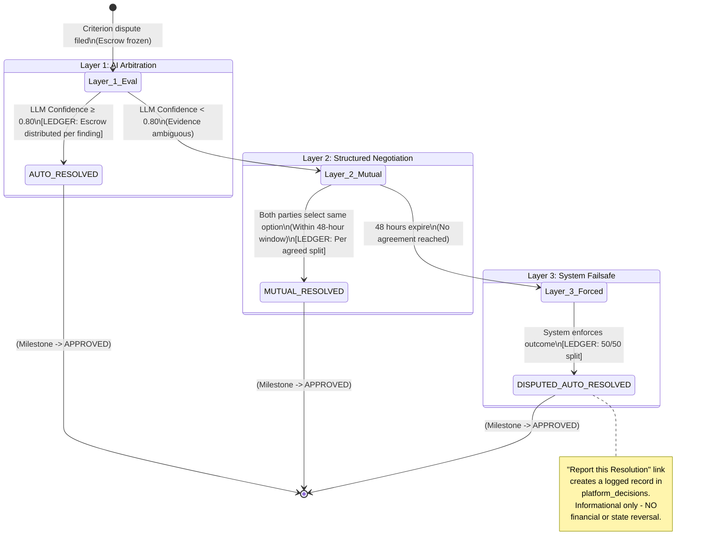

---

## Detailed Narration: Dispute Resolution Layers

The Dispute Resolution state machine is triggered when a milestone is in the `SUBMITTED` or `IN_REVISION` state and a party (Expert, CEO, or Tech Team) files a dispute. At this point, the milestone's escrow is frozen, and this 3-layer protocol takes over to determine how the frozen funds should be distributed. 

The system never allows a dispute to remain unresolved; it systematically escalates until a ledger settlement is triggered.

### Layer 1: LLM Criterion Evaluation (Scalable AI Arbitration)

-   **`Dispute Filed` → `Layer_1_Eval`**
    -   **Trigger:** A party formally submits evidence and rebuttals targeting a specific Acceptance Criterion.
    -   **Logic:** The system locks the evidence and sends it to the FastAPI AI Service. The LLM acts as a neutral technical arbitrator, analyzing the criterion against the submitted deliverable proofs and rebuttals.

-   **`Layer_1_Eval` → `AUTO_RESOLVED` (High Confidence Path)**
    -   **Trigger:** The LLM returns a confidence score ≥ 0.80.
    -   **Logic:** The AI is sure enough to make a binding decision. It determines whether the criterion was met (Expert wins) or not met (Client wins).
    -   **Financial Impact `[LEDGER]`:** The system automatically executes the ledger settlement. If the Expert wins, `ESCROW_RELEASE` (minus platform fee). If the Client wins, `ESCROW_REFUND`.
    -   **Design Intent:** This resolves the vast majority of clear-cut disputes instantly, saving both parties weeks of frustration and saving the platform the cost of human arbitration. 

-   **`Layer_1_Eval` → `Layer_2_Mutual` (Low Confidence Path)**
    -   **Trigger:** The LLM returns a confidence score < 0.80.
    -   **Logic:** The evidence is too ambiguous, contradictory, or lacks objective measurable criteria for the AI to rule reliably. The AI "punts" the decision back to the humans.

### Layer 2: Structured Mutual Agreement (Bounded Human Negotiation)

-   **`Layer_2_Mutual` → `MUTUAL_RESOLVED` (Agreement Path)**
    -   **Trigger:** Both parties select the exact same resolution option from a structured form within the 48-hour window. (e.g., Both select "Release 70% to Expert, Refund 30% to Client").
    -   **Logic:** The system detects a match in selections.
    -   **Financial Impact `[LEDGER]`:** The system executes the custom split. `ESCROW_RELEASE` for the expert's portion, `ESCROW_REFUND` for the client’s portion.
    -   **Design Intent:** Allows for the nuance of AI consulting where "partial completion" is common (e.g., the pipeline works but the latency SLA was missed). A binary win/lose wouldn't be fair here.

-   **`Layer_2_Mutual` → `Layer_3_Forced` (Deadlock Path)**
    -   **Trigger:** The 48-hour timer expires without a matching agreement.
    -   **Logic:** The parties are either refusing to compromise or are unresponsive. To prevent the escrow from being frozen indefinitely, the system forces a resolution.

### Layer 3: Disputed Auto-Resolved (The Structural Failsafe)

-   **`Layer_3_Forced` → `DISPUTED_AUTO_RESOLVED`**
    -   **Trigger:** Escalation from Layer 2 deadlock.
    -   **Logic:** The system enforces a strict 50/50 split of the escrow.
    -   **Financial Impact `[LEDGER]`:** `ESCROW_SPLIT`. `client.available_balance += 50%`, `expert.available_balance += 50%`. No platform fee is typically taken on forced splits.
    -   **Design Intent:** This is the "atomic option" that guarantees finality. While it may feel unfair to one or both parties (a party who delivered 90% of the work only gets 50% of the pay), it is structurally necessary to ensure liquidity and prevent permanent escrow limbo. It penalizes *failure to agree* rather than adjudicating the work itself.

-   **The "Report this Resolution" Link:**
    -   **Logic:** Because Layer 3 feels harsh, the UI provides a venting mechanism. Clicking this link inserts a row into the `platform_decisions` audit log. 
    -   **Crucially:** This is **informational only**. It does *not* reverse the ledger transaction, re-open the dispute, or trigger admin intervention. The financial settlement stands permanent.

### Exit: Returning to the Milestone Lifecycle

Regardless of which layer resolves the dispute (`AUTO_RESOLVED`, `MUTUAL_RESOLVED`, or `DISPUTED_AUTO_RESOLVED`), the outcome is the same for the parent Milestone state machine: The Milestone transitions out of the `DISPUTED` state and into `APPROVED`. 

In AITasker's data model, `APPROVED` means *"the contractual lifecycle of this milestone is closed and the ledger has been settled."* It does not mean the work was perfect; it means the escrow dispute is legally and computationally resolved.

### Summary of Design Intent

The 3-Layer Dispute state machine satisfies RQ3 (Trust) by providing a trust mechanism that doesn't rely on slow, expensive human admins:
1.  **Scalability:** Layer 1 AI handles the easy cases automatically.
2.  **Flexibility:** Layer 2 allows nuanced, custom splits for partial completions.
3.  **Finality:** Layer 3 ensures the system never gets stuck, enforcing liquidity over perfect justice.