# AITasker MVP — State Machine Reference Document
### Scope-Reduced · 28 Tables · Cross-Table CRUD Grounding

> **Purpose:** Definitive state machine reference for teacher assessment. Every state transition is grounded to exact table columns, CHECK constraints, ledger operations, API calls, and NestJS endpoints.  
> **Last updated:** June 2026  
> **Conventions:** `[LEDGER]` = `wallet_transactions` row written. `[API]` = external service call. Tables in **bold** on first reference. §0.x = Master Reference Sheet section from scope-reduced internal doc.

---

## Table of Contents

1. [Elicitation Session States](#1-elicitation-session-states)
2. [Spec / Project States](#2-spec--project-states)
3. [Bid States (Simplified Mutable-Row)](#3-bid-states-simplified-mutable-row)
4. [Engagement States](#4-engagement-states)
5. [Engagement Type (Immutable Discriminator)](#5-engagement-type-immutable-discriminator)
6. [Milestone States](#6-milestone-states)
7. [Acceptance Criterion Verification](#7-acceptance-criterion-verification)
8. [DoD Checklist Item States](#8-dod-checklist-item-states)
9. [Pay-Gated Document States](#9-pay-gated-document-states)
10. [Dispute Resolution (2-Layer)](#10-dispute-resolution-2-layer)
11. [Wallet Transaction Types (Internal Ledger Flow)](#11-wallet-transaction-types-internal-ledger-flow)
12. [Withdrawal States](#12-withdrawal-states)
13. [Subscription States](#13-subscription-states)
14. [Cross-Table CRUD Dependency Map](#14-cross-table-crud-dependency-map)

---

## 1. Elicitation Session States

### Master Reference

- **§0.1 Domains:** A (LLM Application Engineering) — drives the 5-stage conversational diagnostic
- **§0.3 Archetypes:** Determined in Stage 2; locked into `elicitation_sessions.archetype`
- **§0.3 Tiers:** Determined in Stage 3 from scale signals; locked into `projects.tier`
- **§0.4 Verification Tiers:** Not directly involved (elicitation is client-side)
- **§0.5 Match Score:** Output feeds `projects.required_seams_json` which drives MF-5 matching
- **§0.6 Spec states:** Elicitation output determines whether project reaches `PUBLISHED` or `RETURNED_TO_CLIENT`

### Mermaid State Diagram

```mermaid
stateDiagram-v2
    direction TB

    [*] --> IN_PROGRESS : CEO starts session\n(Subscription guard: users.subscription_client_tier='pro')

    state "IN_PROGRESS" as IP {
        direction LR
        Stage1 : Stage 1 — Symptom Intake\n(CEO free-form input)
        Stage2 : Stage 2 — Archetype + SDLC\n(LLM archetype prediction + void injection)
        Stage3 : Stage 3 — Architecture Probe\n(4 behavioral questions)
        Stage4 : Stage 4 — Tech Handoff\n(Scenario A/B/C branching)
        Stage5 : Stage 5 — Synthesis\n(FastAPI LLM synthesis)

        Stage1 --> Stage2 : LLM extraction passes complete
        Stage2 --> Stage3 : Archetype locked;\nSDLC voids injected
        Stage3 --> Stage4 : Scale signals captured\n(tier determined)
        Stage4 --> Stage5 : TECH_TEAM input received\nOR self_technical=true\nOR Scenario A path chosen
    }

    IN_PROGRESS --> COMPLETED : Stage 5 synthesis produced\nprojects row created;\nstate = PUBLISHED
    IN_PROGRESS --> RETURNED : Auto-publish quality gate FAILED\n(LLM advisory note generated;\nvoid_list_json updated)
    IN_PROGRESS --> ABANDONED : CEO navigated away\n(can resume from current_stage)

    RETURNED --> IN_PROGRESS : CEO re-enters at specific void\n(NOT from stage 1)

    COMPLETED --> [*]
    ABANDONED --> IN_PROGRESS : CEO resumes session
```

### State-by-State Narration

#### `[*]` → `IN_PROGRESS`

- **Trigger:** CEO clicks "Start New AI Project"
- **Guard:** `SELECT subscription_client_tier FROM users WHERE id = ?` → must be `'pro'` (§0.9 Feature Gate)
- **DB Operation:**
  ```sql
  INSERT INTO elicitation_sessions
    (user_id, current_stage, archetype, scenario_type, void_list_json, state, created_at, updated_at)
  VALUES (?, 1, NULL, NULL, '[]', 'IN_PROGRESS', now(), now());
  ```
- **Tables:** `elicitation_sessions` (C), `users` (R — guard)
- **Endpoint:** `POST /elicitation/sessions`
- **State Change:** `elicitation_sessions.state = 'IN_PROGRESS'`, `current_stage = 1`

#### `IN_PROGRESS` (internal stage advances)

- **Stage 1→2:** FastAPI LLM extraction (`POST /llm/elicitation/stage1-extract`) updates `void_list_json`. `UPDATE elicitation_sessions SET current_stage = 2, void_list_json = ?, updated_at = now() WHERE id = ?`
- **Stage 2→3:** Archetype locked. `UPDATE elicitation_sessions SET archetype = ?, current_stage = 3, updated_at = now() WHERE id = ?`
- **Stage 3→4:** Tier determined. `UPDATE elicitation_sessions SET current_stage = 4, updated_at = now() WHERE id = ?`
- **Stage 4 branching:**
  - **Scenario A (no TECH_TEAM):** `UPDATE elicitation_sessions SET scenario_type = 'SCENARIO_A'` → system offers TECH_DISCOVERY
  - **Scenario B (self-technical):** `UPDATE elicitation_sessions SET scenario_type = 'SCENARIO_B'` → `UPDATE projects SET self_technical = true`
  - **Standard (TECH_TEAM handoff):** MF-3 creates `tech_team_profiles` row
- **Stage 4→5:** `UPDATE elicitation_sessions SET current_stage = 5, updated_at = now() WHERE id = ?`

#### `IN_PROGRESS` → `COMPLETED`

- **Trigger:** Stage 5 synthesis succeeds AND auto-publish quality gate passes
- **DB Operation (atomic transaction):**
  ```sql
  -- Create project with all JSONB footprint columns
  INSERT INTO projects
    (client_id, elicitation_session_id, state, archetype, tier, self_technical,
     required_seams_json, required_domains_json, milestone_framework_json,
     artifact_a_json, artifact_b_json, created_at)
  VALUES (?, ?, 'PUBLISHED', ?, ?, ?,
          ?::jsonb, ?::jsonb, ?::jsonb,
          ?::jsonb, ?::jsonb, now());

  -- Close elicitation session
  UPDATE elicitation_sessions
    SET state = 'COMPLETED', updated_at = now()
    WHERE id = ?;

  -- Log platform decision
  INSERT INTO platform_decisions
    (decision_type, entity_type, entity_id, llm_confidence, decision, created_at)
  VALUES ('ELICITATION_SYNTHESIS', 'elicitation_sessions', ?,
          ?, 'PASSED_ALL_GATES', now());
  ```
- **Tables:** `projects` (C), `elicitation_sessions` (U), `platform_decisions` (C)
- **Endpoint:** `POST /elicitation/sessions/{id}/synthesize`
- **Side Effect:** Matching engine fires (MF-5) — reads `projects.required_seams_json` and `projects.required_domains_json`
- **State Change:** `elicitation_sessions.state = 'COMPLETED'`, `projects.state = 'PUBLISHED'`

#### `IN_PROGRESS` → `RETURNED`

- **Trigger:** Auto-publish quality gate fails (footprint completeness < 0.7 OR match pre-check finds 0 experts OR unresolved hard-flagged voids)
- **DB Operation (atomic transaction):**
  ```sql
  UPDATE elicitation_sessions
    SET state = 'RETURNED', updated_at = now()
    WHERE id = ?;

  INSERT INTO platform_decisions
    (decision_type, entity_type, entity_id, llm_confidence, decision, advisory_note, created_at)
  VALUES ('SPEC_AUTO_RETURN', 'elicitation_sessions', ?,
          ?, 'FAILED_QUALITY_GATE', ?, now());
  -- advisory_note contains LLM-generated targeted note identifying the specific void
  ```
- **Tables:** `elicitation_sessions` (U), `platform_decisions` (C)
- **State Change:** `elicitation_sessions.state = 'RETURNED'`
- **Note:** No `projects` row is created on failure. CEO re-enters at the specific void — not from Stage 1.

#### `RETURNED` → `IN_PROGRESS`

- **Trigger:** CEO re-enters elicitation to fix the void
- **DB Operation:** `UPDATE elicitation_sessions SET state = 'IN_PROGRESS', updated_at = now() WHERE id = ?`
- **Tables:** `elicitation_sessions` (U)
- **Key Design:** `current_stage` is preserved — CEO resumes at the exact stage/void that caused failure

#### `IN_PROGRESS` → `ABANDONED`

- **Trigger:** CEO navigates away from elicitation without completing
- **DB Operation:** `UPDATE elicitation_sessions SET state = 'ABANDONED', updated_at = now() WHERE id = ?`
- **Tables:** `elicitation_sessions` (U)
- **Key Design:** Session can be resumed — `current_stage` preserved

### Cross-Table CRUD Map

```
users (R — subscription guard)
  │
  ▼
elicitation_sessions (C on start, U on stage advance, U on complete/return/abandon)
  │
  ├──► projects (C on COMPLETED — contains all 5 JSONB footprint columns)
  │       .required_seams_json      ← §0.2 seams
  │       .required_domains_json    ← §0.1 domains
  │       .milestone_framework_json ← milestone structure
  │       .artifact_a_json          ← public spec (visible to matched experts)
  │       .artifact_b_json          ← technical vault (state-gated, §0.7 RBAC)
  │
  ├──► tech_team_profiles (C in Stage 4 — Scenario Standard)
  │       .linked_client_id → users.id (CEO)
  │       .linked_project_id → projects.id (scope lock)
  │
  └──► platform_decisions (C on quality gate result)
          .decision_type IN ('ELICITATION_SYNTHESIS','SPEC_AUTO_RETURN')
```

---

## 2. Spec / Project States

### Master Reference

- **§0.2 Seams:** `projects.required_seams_json` populated by Stage 5 synthesis
- **§0.3 Archetypes + Tiers:** `projects.archetype`, `projects.tier` locked by elicitation
- **§0.5 Match Score:** Computed against `projects.required_seams_json` and `projects.required_domains_json`
- **§0.6 Elicitation states:** Feed into project creation
- **§0.7 RBAC:** CEO excluded from `artifact_b_json` at route level regardless of engagement state

### Mermaid State Diagram

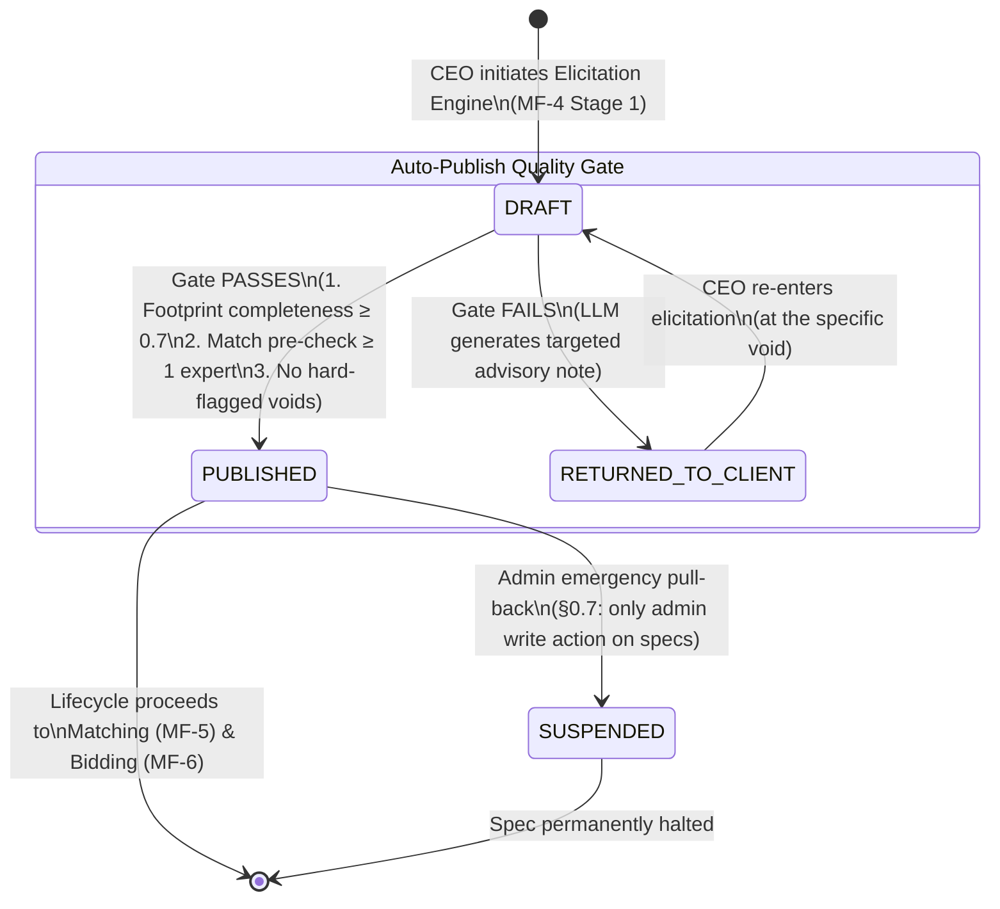

### State-by-State Narration

#### `[*]` → `DRAFT`

- **Trigger:** CEO enters Elicitation Engine
- **Logic:** The `DRAFT` state encompasses the entire 5-stage conversational assembly. No `projects` row exists yet — the spec is being built within `elicitation_sessions`. The project row is only created at Stage 5 synthesis.
- **Tables:** `elicitation_sessions` (C — `state = 'IN_PROGRESS'`)
- **Key Design:** `DRAFT` is a logical state. The physical row in `projects` is only created when synthesis succeeds.

#### `DRAFT` → `PUBLISHED`

- **Trigger:** Auto-publish quality gate passes all three checks
- **Quality Gate Checks (executed in `POST /elicitation/sessions/{id}/synthesize`):**
  1. **Footprint completeness ≥ 0.7:** `required_seams_json` meets archetype minimum, `milestone_framework_json` populated
  2. **Match pre-check:** `SELECT COUNT(*) FROM expert_seam_claims WHERE seam_code = ANY(required_seams)` → at least 1 expert above minimum threshold
  3. **No hard-flagged voids:** `elicitation_sessions.void_list_json` has no unresolved `injected: false` entries for mandatory voids
- **DB Operation:** See Elicitation `IN_PROGRESS` → `COMPLETED` above (atomic transaction creating `projects` row with `state = 'PUBLISHED'`)
- **Tables:** `projects` (C), `elicitation_sessions` (U), `platform_decisions` (C)
- **Side Effect:** Matching engine triggered automatically (MF-5)
- **State Change:** `projects.state = 'PUBLISHED'`

#### `DRAFT` → `RETURNED_TO_CLIENT`

- **Trigger:** Quality gate fails
- **DB Operation:**
  ```sql
  -- No projects row created — session returns to CEO
  UPDATE elicitation_sessions SET state = 'RETURNED', updated_at = now() WHERE id = ?;

  INSERT INTO platform_decisions
    (decision_type, entity_type, entity_id, decision, advisory_note, created_at)
  VALUES ('SPEC_AUTO_RETURN', 'elicitation_sessions', ?,
          'FAILED_QUALITY_GATE', ?, now());
  -- advisory_note = LLM-generated targeted note identifying the specific void
  ```
- **Tables:** `elicitation_sessions` (U), `platform_decisions` (C)
- **State Change:** `elicitation_sessions.state = 'RETURNED'`
- **Key Design:** CEO re-enters at the specific void — not from the beginning. No admin queue. The system is self-correcting.

#### `RETURNED_TO_CLIENT` → `DRAFT`

- **Trigger:** CEO re-enters elicitation to fix the identified void
- **Logic:** `elicitation_sessions.current_stage` is preserved. CEO resumes at the exact point of failure.
- **Tables:** `elicitation_sessions` (U — `state = 'IN_PROGRESS'`)

#### `PUBLISHED` → `SUSPENDED`

- **Trigger:** Admin emergency pull-back (§0.7 — one of two admin write actions)
- **DB Operation:**
  ```sql
  UPDATE projects SET state = 'SUSPENDED' WHERE id = ?;
  ```
- **Tables:** `projects` (U)
- **Endpoint:** `PUT /admin/projects/{id}/suspend-spec`
- **Guard:** `active_role = 'ADMIN'`
- **Key Design:** Passive, reactive only — admin does not pre-approve specs. This is for emergency situations like accidentally exposed proprietary data in `artifact_a_json`.

### Cross-Table CRUD Map

```
elicitation_sessions ──(1:1)──► projects (C on PUBLISHED)
                              .state CHECK IN ('DRAFT','PUBLISHED','RETURNED_TO_CLIENT','SUSPENDED')
                              .artifact_a_json  — visible to matched experts pre-bid
                              .artifact_b_json  — route-gated (§0.7 RBAC)
                              .required_seams_json   — feeds matching engine (§0.5)
                              .required_domains_json — feeds matching engine (§0.5)

projects ──(1:N)──► engagements (C when bid SELECTED)
projects ──(1:N)──► tech_team_profiles (C in Stage 4 handoff)

platform_decisions (C on quality gate pass/fail)
  .decision_type IN ('ELICITATION_SYNTHESIS','SPEC_AUTO_RETURN')
  .entity_type = 'elicitation_sessions'
  .entity_id = elicitation_session_id (polymorphic)
```

### Scope Reduction Note

In the full 51-table spec, `capability_footprints`, `artifact_a`, and `artifact_b` were three separate tables. In the MVP, all five fields are JSONB columns on `projects`. The trust gate is identical — it is a FastAPI route guard, not a DB-level constraint. No architectural value is lost.

---

## 3. Bid States (Simplified Mutable-Row)

### Master Reference

- **§0.1 Domains:** Expert's `footprint_alignment_json` must demonstrate domain depth
- **§0.2 Seams:** Expert's bid must address `projects.required_seams_json`
- **§0.4 Verification Tiers:** Tier 2 experts can bid on Tier 2-3 projects (Expert Pro gate)
- **§0.5 Match Score:** Bid submission only possible for experts who appeared in shortlist
- **§0.6 Bid states:** Simplified from full 4-surface system
- **§0.7 RBAC:** TECH_TEAM approves before CEO selects; CEO cannot see bid until tech_status = APPROVED; pre-bid questions use `messages` channel

### Mermaid State Diagram

```mermaid
stateDiagram-v2
    direction TB

    [*] --> DRAFT : Expert initiates bid\n(Engagement + Bid rows created)

    DRAFT --> SUBMITTED : Expert submits 3-component bid\n(footprint_alignment_json,\napproach_summary,\nconditional_pricing_json)

    SUBMITTED --> TECH_REVIEW : TECH_TEAM opens review\n(bid.state = TECH_REVIEW)

    state "Technical Review Loop" as TechLoop {
        direction TB
        TECH_REVIEW --> REVISION_REQUESTED : TECH_TEAM sets\ntech_status = REVISION_REQUESTED\n(+ writes tech_feedback)
        REVISION_REQUESTED --> TECH_REVIEW : Expert edits bid row\n(resets tech_status = PENDING;\nversion_number increments)
    }

    TECH_REVIEW --> TECH_APPROVED : tech_status = APPROVED\n(Unlocks CEO_REVIEW)

    state "CEO Review" as CEOReview {
        direction TB
        TECH_APPROVED --> CEO_REVIEW : CEO dashboard unlocks\n(guard: tech_status = APPROVED)
        CEO_REVIEW --> PRICE_COUNTER : CEO writes\nnegotiated_price_vnd\n(one round only)
        PRICE_COUNTER --> CEO_DECISION : Expert accepts/declines\ncounter-offer
        CEO_REVIEW --> CEO_DECISION : CEO accepts\noriginal pricing
    }

    CEO_DECISION --> SELECTED : ceo_status = APPROVED\n→ engagement proceeds to connection
    CEO_DECISION --> DECLINED : ceo_status = DECLINED

    SELECTED --> [*]
    DECLINED --> [*]

    note right of TechLoop
        Mutable row model:
        No bid_versions table.
        Expert edits capability_bids
        row in place.
        tech_feedback column replaces
        cut bid_revision_requests table.
    end note

    note right of PRICE_COUNTER
        negotiated_price_vnd column
        replaces cut price_negotiations
        table. One round only.
    end note
```

### State-by-State Narration

#### `[*]` → `DRAFT`

- **Trigger:** Expert clicks "Bid on this project" from shortlist
- **Guards:**
  - `users.subscription_expert_tier = 'pro'` (for Tier 2-3 projects per §0.9)
  - Self-exclusion: `expert.user_id NOT IN (SELECT user_id FROM project_members WHERE project_id = ?)`
- **DB Operation (atomic):**
  ```sql
  -- Create engagement shell
  INSERT INTO engagements
    (project_id, expert_id, service_id, type, state, client_nda_accepted_at, expert_nda_accepted_at)
  VALUES (?, ?, NULL, 'PROJECT_BASED', 'PENDING', NULL, NULL);

  -- Create bid linked to engagement (1:1)
  INSERT INTO capability_bids
    (engagement_id, footprint_alignment_json, approach_summary,
     conditional_pricing_json, state, tech_status, ceo_status,
     tech_feedback, negotiated_price_vnd, version_number)
  VALUES (?, NULL, NULL, NULL, 'DRAFT', 'PENDING', 'PENDING', NULL, NULL, 1);
  ```
- **Tables:** `engagements` (C), `capability_bids` (C)
- **Key Constraint:** `capability_bids.engagement_id UNIQUE` — enforces 1:1 bid per engagement
- **Endpoint:** `POST /bids` (creates both rows atomically)

#### `DRAFT` → `SUBMITTED`

- **Trigger:** Expert submits all 3 bid components
- **Validation:** All 3 components must be non-NULL — 422 if any missing
- **DB Operation:**
  ```sql
  UPDATE capability_bids SET
    footprint_alignment_json = ?::jsonb,
    approach_summary = ?,
    conditional_pricing_json = ?::jsonb,
    state = 'SUBMITTED'
  WHERE id = ?;
  ```
- **Tables:** `capability_bids` (U)
- **State Change:** `capability_bids.state = 'SUBMITTED'`, `tech_status = 'PENDING'`, `ceo_status = 'PENDING'`
- **Endpoint:** `PUT /bids/{id}` (with validation)

#### `SUBMITTED` → `TECH_REVIEW`

- **Trigger:** TECH_TEAM opens the bid in their dashboard
- **DB Operation:** `UPDATE capability_bids SET state = 'TECH_REVIEW' WHERE id = ?`
- **Tables:** `capability_bids` (U)
- **RBAC Guard:** `active_role = 'CLIENT' AND client_subtype = 'TECH_TEAM'`
- **Endpoint:** `PUT /bids/{id}/tech-review`

#### `TECH_REVIEW` → `REVISION_REQUESTED` (Tech Review Loop)

- **Trigger:** TECH_TEAM identifies a flaw in a specific component
- **DB Operation:**
  ```sql
  UPDATE capability_bids SET
    tech_status = 'REVISION_REQUESTED',
    tech_feedback = 'Approach does not address A↔C seam mitigation strategy'
  WHERE id = ?;
  ```
- **Tables:** `capability_bids` (U — `tech_status`, `tech_feedback`)
- **Key Design:** `tech_feedback` is a TEXT column on `capability_bids` — replaces the cut `bid_revision_requests` table. Expert reads this feedback and edits in place.
- **Endpoint:** `PUT /bids/{id}/tech-review`

#### `REVISION_REQUESTED` → `TECH_REVIEW` (Loop Back)

- **Trigger:** Expert reads `tech_feedback`, edits bid row, resets `tech_status`
- **DB Operation:**
  ```sql
  UPDATE capability_bids SET
    approach_summary = '...updated approach addressing A↔C seam',
    tech_status = 'PENDING',
    version_number = version_number + 1,
    state = 'TECH_REVIEW'
  WHERE id = ?;
  ```
- **Tables:** `capability_bids` (U — mutable row, no separate version table)
- **Key Scope Reduction:** No `bid_versions` table. Version tracking is a simple integer increment on the same row. Previous content is not preserved as separate snapshots.
- **Endpoint:** `PUT /bids/{id}`

#### `TECH_REVIEW` → `TECH_APPROVED`

- **Trigger:** TECH_TEAM sets `tech_status = 'APPROVED'`
- **DB Operation:**
  ```sql
  UPDATE capability_bids SET tech_status = 'APPROVED' WHERE id = ?;
  ```
- **Tables:** `capability_bids` (U — `tech_status`)
- **Side Effect:** CEO_REVIEW unlocks in CEO dashboard (UI guard reads `tech_status`)
- **Endpoint:** `PUT /bids/{id}/tech-review`

#### `TECH_APPROVED` → `CEO_REVIEW`

- **Trigger:** CEO dashboard detects `tech_status = 'APPROVED'` and renders bid review
- **DB Operation:** `UPDATE capability_bids SET state = 'CEO_REVIEW' WHERE id = ?`
- **Route Guard on `PUT /bids/{id}/ceo-decision`:**
  ```sql
  SELECT tech_status FROM capability_bids WHERE id = ?;
  -- IF tech_status != 'APPROVED' → 422 "Tech review not complete"
  ```
- **Tables:** `capability_bids` (R — guard, U — state)

#### `CEO_REVIEW` → `PRICE_COUNTER` (Optional)

- **Trigger:** CEO writes `negotiated_price_vnd` as a counter-offer
- **DB Operation:**
  ```sql
  UPDATE capability_bids SET
    negotiated_price_vnd = 4500000
  WHERE id = ?;
  ```
- **Tables:** `capability_bids` (U — `negotiated_price_vnd`)
- **Key Scope Reduction:** `negotiated_price_vnd` BIGINT column replaces the cut `price_negotiations` table. One round only — no `round_number` tracking needed.
- **Endpoint:** `PUT /bids/{id}/ceo-decision`

#### `CEO_REVIEW` / `PRICE_COUNTER` → `SELECTED` / `DECLINED`

- **Trigger:** CEO sets `ceo_status`
- **DB Operation:**
  ```sql
  UPDATE capability_bids SET
    ceo_status = 'APPROVED',  -- or 'DECLINED'
    state = 'SELECTED'        -- or 'DECLINED'
  WHERE id = ?;
  ```
- **Tables:** `capability_bids` (U — `ceo_status`, `state`)
- **State Change:**
  - `ceo_status = 'APPROVED'` → `state = 'SELECTED'` → engagement proceeds to connection flow (MF-6 Phase E)
  - `ceo_status = 'DECLINED'` → `state = 'DECLINED'` → engagement terminated
- **Endpoint:** `PUT /bids/{id}/ceo-decision`

### Cross-Table CRUD Map

```
engagements (C on bid initiation — type='PROJECT_BASED', state='PENDING')
  │
  └──(1:1)──► capability_bids (C on DRAFT, U on every subsequent transition)
                .state CHECK IN ('DRAFT','SUBMITTED','TECH_REVIEW','REVISION_REQUESTED',
                                 'TECH_APPROVED','CEO_REVIEW','SELECTED','DECLINED')
                .tech_status CHECK IN ('PENDING','APPROVED','REVISION_REQUESTED')
                .ceo_status CHECK IN ('PENDING','APPROVED','DECLINED')
                .tech_feedback TEXT NULL         ← replaces cut bid_revision_requests
                .negotiated_price_vnd BIGINT NULL ← replaces cut price_negotiations
                .version_number INT DEFAULT 1    ← simple counter, no FK to version table

projects (R — artifact_a_json read by expert pre-bid)
messages (C — pre-bid questions; replaces cut spec_clarifications table)
```

### Scope Reduction Summary

| Full Spec Feature | Full Spec Table | MVP Replacement | Where It Lives |
|---|---|---|---|
| Surface A (Spec Clarifications) | `spec_clarifications` | `messages` channel | `messages` table |
| Surface B (Bid Revision Requests) | `bid_revision_requests` | `tech_feedback` column | `capability_bids.tech_feedback` |
| Bid Version History | `bid_versions` | `version_number` increment | `capability_bids.version_number` |
| Surface C (Price Negotiation) | `price_negotiations` | `negotiated_price_vnd` column | `capability_bids.negotiated_price_vnd` |
| Surface D (CEO Conflict Override) | `bid_conflict_overrides` | `tech_status`/`ceo_status` independence | `capability_bids` dual columns |

---

## 4. Engagement States

### Master Reference

- **§0.1 Domains:** Engagement scope determined by project's `required_domains_json`
- **§0.2 Seams:** Engagement inherits required seams from project
- **§0.3 Archetypes:** `engagement.type = 'PROJECT_BASED'` implies full archetype-driven flow
- **§0.5 Match Score:** Engagement created after expert is selected from shortlist
- **§0.6 Bid states:** `SELECTED` state triggers engagement `PENDING`
- **§0.7 RBAC:** NDA click-through required for both parties before `CONNECTED`; CEO excluded from `artifact_b_json`

### Mermaid State Diagram

```mermaid
stateDiagram-v2
    direction TB

    [*] --> PENDING : Path A: CEO selects Expert\n(bid.state = SELECTED)
    [*] --> ACTIVE : Path B: SERVICE_PURCHASE\n(IPN confirms VA payment;\nno bid, no NDA)
    [*] --> ACTIVE : Path C: TECH_DISCOVERY\n(IPN confirms VA payment;\nno bid, no NDA)

    PENDING --> CONNECTED : Expert accepts +\nBOTH NDA timestamps set\n(client_nda_accepted_at +\nexpert_nda_accepted_at)
    PENDING --> [*] : Expert declines connection

    CONNECTED --> ACTIVE : First milestone funded\n(SePay IPN confirms ESCROW_LOCK;\nmilestone.state = FUNDED)

    state "Active Engagement" as ActiveEng {
        direction TB
        ACTIVE --> CLOSED : All milestones RELEASED\n(ledger fully settled)
        ACTIVE --> DISPUTED : Dispute filed on milestone\n(escrow FROZEN)
        DISPUTED --> ACTIVE : Dispute resolved\n(escrow settled per resolution)
    }

    CLOSED --> [*]
```

### State-by-State Narration

#### `[*]` → `PENDING` (Path A — PROJECT_BASED)

- **Trigger:** CEO selects expert from shortlist (bid reaches `SELECTED` state)
- **DB Operation:**
  ```sql
  -- Engagement already created during bid initiation (step DRAFT in Bid states)
  -- At SELECTED, engagement already exists with state='PENDING'
  -- No additional DB operation needed — engagement row was created at bid initiation
  ```
- **Tables:** `engagements` (already exists from bid creation)
- **Key Design:** Engagement is created when expert first clicks "Bid" — not when selected. The `PENDING` state means "connection request sent, awaiting expert acceptance."

#### `[*]` → `ACTIVE` (Path B/C — SERVICE_PURCHASE / TECH_DISCOVERY)

- **Trigger:** SePay IPN confirms payment on SERVICE VA
- **DB Operation (within IPN handler transaction):**
  ```sql
  INSERT INTO engagements
    (project_id, expert_id, service_id, type, state,
     client_nda_accepted_at, expert_nda_accepted_at, connected_at)
  VALUES (NULL, ?, ?, 'SERVICE_PURCHASE', 'ACTIVE', now(), now(), now());
  -- For TECH_DISCOVERY: type = 'TECH_DISCOVERY'
  -- NDA timestamps set immediately — no connection gate needed for services
  ```
- **Table-level CHECK enforced:**
  ```sql
  CONSTRAINT engagement_type_fk CHECK (
    (type = 'PROJECT_BASED' AND project_id IS NOT NULL AND service_id IS NULL) OR
    (type IN ('SERVICE_PURCHASE','TECH_DISCOVERY') AND project_id IS NULL AND service_id IS NOT NULL)
  )
  ```
- **Tables:** `engagements` (C — Path B/C)
- **Endpoint:** `POST /services/{id}/purchase` → IPN `POST /webhooks/sepay/ipn`

#### `PENDING` → `CONNECTED`

- **Trigger:** Expert accepts connection request + both parties complete NDA click-through
- **Guards:**
  - `users.sepay_bank_account_xid IS NOT NULL` for expert (Bank Hub link required)
  - BOTH `client_nda_accepted_at` AND `expert_nda_accepted_at` must be set
- **DB Operation:**
  ```sql
  UPDATE engagements SET
    client_nda_accepted_at = ?,   -- CEO clicked NDA checkbox
    expert_nda_accepted_at = ?,   -- Expert clicked NDA checkbox
    state = 'CONNECTED',
    connected_at = now()
  WHERE id = ?;
  ```
- **Tables:** `engagements` (U)
- **Side Effect:** Artifact B becomes queryable via FastAPI route guard:
  ```
  Return artifact_b_json ONLY when:
    engagement.state >= 'CONNECTED'
    AND client_nda_accepted_at IS NOT NULL
    AND expert_nda_accepted_at IS NOT NULL
    AND requester.active_role IN ('EXPERT', 'TECH_TEAM')
    AND requester.client_subtype != 'CEO'  -- CEO permanently excluded
  ```
- **Endpoints:** `POST /engagements/{id}/connect`, `PUT /engagements/{id}/accept-nda`

#### `CONNECTED` → `ACTIVE`

- **Trigger:** First milestone funded (SePay IPN confirms ESCROW_LOCK)
- **DB Operation (within IPN MILESTONE handler):**
  ```sql
  UPDATE engagements SET state = 'ACTIVE' WHERE id = ?;
  ```
- **Tables:** `engagements` (U)
- **Key Design:** Engagement is not `ACTIVE` until money is secured in escrow. Expert is not expected to perform billable work until this transition.

#### `ACTIVE` ↔ `DISPUTED`

- **Trigger (to DISPUTED):** Any party files a dispute on an active milestone
- **DB Operation:**
  ```sql
  UPDATE engagements SET state = 'DISPUTED' WHERE id = ?;
  ```
- **Trigger (back to ACTIVE):** Dispute resolved
- **DB Operation:**
  ```sql
  UPDATE engagements SET state = 'ACTIVE' WHERE id = ?;
  -- Only if other milestones remain; if all resolved → CLOSED
  ```
- **Tables:** `engagements` (U)
- **Key Design:** Dispute on a single milestone (micro) doesn't terminate the entire engagement (macro). Other milestones can continue.

#### `ACTIVE` → `CLOSED`

- **Trigger:** All milestones in the engagement reach `RELEASED` or dispute is fully resolved
- **DB Operation:**
  ```sql
  UPDATE engagements SET state = 'CLOSED' WHERE id = ?;
  ```
- **Tables:** `engagements` (U)
- **Side Effect:** Post-engagement review forms become available (MF-11)

### Cross-Table CRUD Map

```
projects ──(1:N)──► engagements (project_id NULL for Path B/C)
services ──(1:N)──► engagements (service_id NULL for Path A)
expert_profiles ──(1:N)──► engagements

engagements ──(1:1)──► capability_bids (Path A only)
engagements ──(1:N)──► milestones
engagements ──(1:N)──► escrow_accounts
  (via partial unique index WHERE engagement_id IS NOT NULL — Path B/C)
engagements ──(1:N)──► messages
engagements ──(1:N)──► disputes
engagements ──(1:N)──► reviews

Engagement type-FK consistency enforced by table-level CHECK constraint
```

---

## 5. Engagement Type (Immutable Discriminator)

### Master Reference

- **§0.3 Archetypes:** PROJECT_BASED uses full archetype-driven flow; others do not
- **§0.5 Match Score:** Only computed for PROJECT_BASED engagements
- **§0.6 Bid states:** Only PROJECT_BASED has bid; SERVICE_PURCHASE/TECH_DISCOVERY skip bid
- **§0.7 RBAC:** TECH_TEAM role only invoked in PROJECT_BASED

### Mermaid Diagram

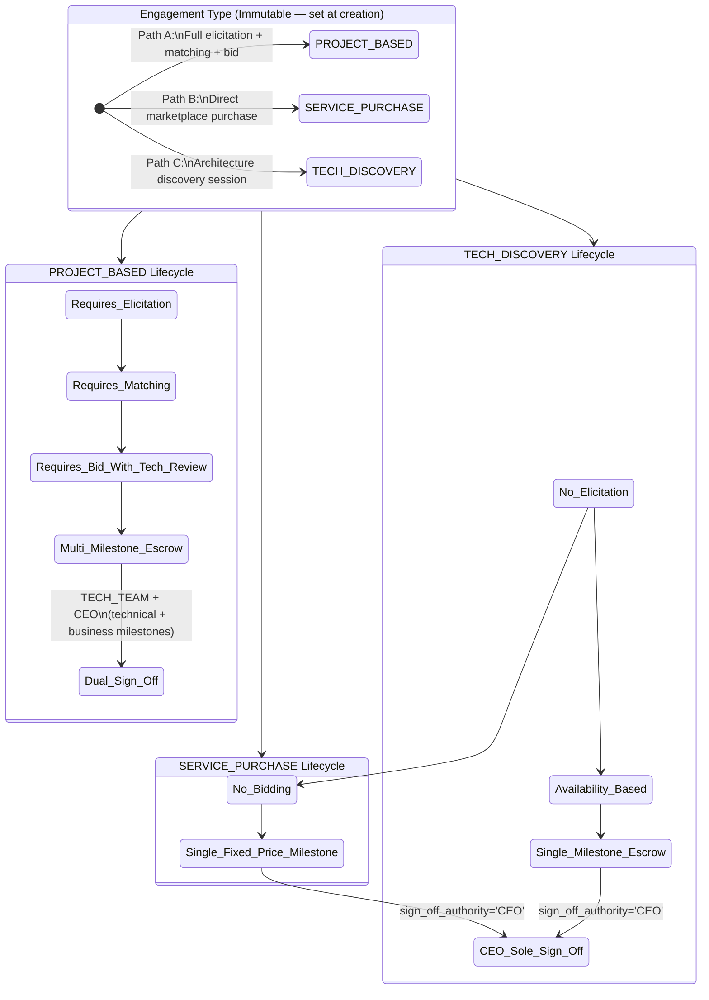

### Type-by-Type Narration

#### PROJECT_BASED (Path A)

- **Creation:** Engagement row created when expert initiates bid
- **Structural Requirements:**
  - `project_id NOT NULL`, `service_id NULL` (enforced by CHECK constraint)
  - Requires AI Elicitation Engine (MF-4) producing `projects.required_seams_json`
  - Requires matching engine (MF-5) producing shortlist
  - Requires bid with tech_status/ceo_status dual-approval (MF-6)
  - Multi-milestone escrow with `sign_off_authority` ∈ {TECH_TEAM, CEO, JOINT}
- **Tables Involved:** `projects`, `engagements`, `capability_bids`, `milestones`, `acceptance_criteria`, `escrow_accounts`
- **RBAC:** TECH_TEAM role active; Artifact B state-gated; pay-gated documents released to TECH_TEAM

#### SERVICE_PURCHASE (Path B)

- **Creation:** Engagement row created in IPN SERVICE handler
- **Structural Requirements:**
  - `project_id NULL`, `service_id NOT NULL` (enforced by CHECK constraint)
  - No elicitation — spec is the service description
  - No bidding — price is `services.price_vnd`
  - Single fixed-price milestone with `sign_off_authority = 'CEO'`
  - Escrow on `engagement_id` (not `milestone_id`)
- **Tables Involved:** `services`, `engagements`, `milestones` (auto-created), `escrow_accounts`
- **RBAC:** No TECH_TEAM involvement; CEO sole sign-off; no Artifact B; no pay-gated documents

#### TECH_DISCOVERY (Path C)

- **Creation:** Either from elicitation Scenario A offer or direct marketplace purchase
- **Structural Requirements:**
  - `project_id NULL`, `service_id NOT NULL` with `services.service_type = 'TECH_DISCOVERY'`
  - Single milestone; deliverable is a discovery report
  - CEO sole sign-off
- **Strategic Purpose:** Output provides technical truth for a future PROJECT_BASED engagement

### DB-Level Enforcement

```sql
-- Table-level CHECK on engagements
CONSTRAINT engagement_type_fk CHECK (
  (type = 'PROJECT_BASED' AND project_id IS NOT NULL AND service_id IS NULL) OR
  (type IN ('SERVICE_PURCHASE','TECH_DISCOVERY') AND project_id IS NULL AND service_id IS NOT NULL)
)

-- Escrow dual-parent structure
CONSTRAINT escrow_has_one_parent CHECK (
  (milestone_id IS NOT NULL AND engagement_id IS NULL) OR
  (milestone_id IS NULL AND engagement_id IS NOT NULL)
)

-- Partial unique indexes for escrow
CREATE UNIQUE INDEX escrow_milestone_unique ON escrow_accounts(milestone_id) WHERE milestone_id IS NOT NULL;
CREATE UNIQUE INDEX escrow_engagement_unique ON escrow_accounts(engagement_id) WHERE engagement_id IS NOT NULL;
```

---

## 6. Milestone States

### Master Reference

- **§0.1 Domains:** Milestone deliverables address specific domain requirements
- **§0.2 Seams:** Acceptance criteria reference specific seam performance
- **§0.5 Match Score:** Not directly involved (milestone is post-matching)
- **§0.6 DoD states:** DoD items must all be COMPLETED before SUBMITTED transition
- **§0.6 Dispute states:** DISPUTED milestone enters 2-layer resolution
- **§0.8 Payment Architecture:** ESCROW_LOCK on FUNDED, ESCROW_RELEASE on APPROVED

### Mermaid State Diagram

```mermaid
stateDiagram-v2
    direction TB

    [*] --> DEFINED : CEO creates milestone\n(acceptance_criteria + DoD items set)

    DEFINED --> AWAITING_PAYMENT : CEO clicks 'Fund'\n(per-milestone VA generated;\nfixed_amount set;\nVietQR displayed)

    AWAITING_PAYMENT --> FUNDED : SePay IPN confirms credit\n[LEDGER: ESCROW_LOCK]\n(va.fixed_amount validated)

    FUNDED --> IN_PROGRESS : Auto-advance\n(Expert begins work;\npaygated_documents → RELEASED)

    IN_PROGRESS --> SUBMITTED : Expert submits deliverable\n(GUARD: all required DoD items = COMPLETED)

    SUBMITTED --> IN_REVISION : Sign-off authority requests revision\n(revision_note written on\nacceptance_criteria)

    IN_REVISION --> SUBMITTED : Expert resubmits deliverable\n(new milestone_submissions row)

    SUBMITTED --> DISPUTED : Party files dispute\n(escrow FROZEN;\ndisputes row created)
    IN_REVISION --> DISPUTED : Party files dispute

    state "DISPUTED" as DISPUTED {
        direction TB
        [*] --> LAYER_1_EVAL : LLM criterion evaluation
        LAYER_1_EVAL --> AUTO_RESOLVED : confidence ≥ 0.80\n[LEDGER: per LLM finding]
        LAYER_1_EVAL --> MANUAL_REVIEW : confidence < 0.80\n(admin resolves)
        MANUAL_REVIEW --> RESOLVED : Admin clicks button\n[LEDGER: per admin decision]
    }

    DISPUTED --> APPROVED : Dispute resolved\n(ledger settled per resolution)

    SUBMITTED --> APPROVED : All required criteria verified\n[LEDGER: ESCROW_RELEASE]\n[LEDGER: PLATFORM_FEE]\n[LEDGER: CREDIT_EXPERT]\n[API: SePay chi hộ fires]

    IN_REVISION --> APPROVED : Revised work accepted\n(same ledger + API flow)

    APPROVED --> RELEASED : SePay chi hộ credit IPN confirms\n(withdrawal_requests.status = COMPLETED)

    RELEASED --> [*]

    note right of FUNDED
        On FUNDED transition:
        paygated_documents.release_state
        → 'RELEASED' automatically
        (TECH_TEAM-only read)
    end note
```

### State-by-State Narration

#### `[*]` → `DEFINED`

- **Trigger:** CEO creates milestone within an engagement
- **DB Operation:**
  ```sql
  INSERT INTO milestones
    (engagement_id, milestone_number, deliverable_statement,
     sign_off_authority, payment_amount_vnd, state,
     va_number, va_expires_at, funded_at, submitted_at, approved_at, released_at)
  VALUES (?, ?, ?, ?, ?, 'DEFINED', NULL, NULL, NULL, NULL, NULL, NULL);
  ```
- **Constraint:** `sign_off_authority CHECK IN ('TECH_TEAM','CEO','JOINT')`
- **Constraint:** `(engagement_id, milestone_number)` UNIQUE
- **Tables:** `milestones` (C)
- **Endpoint:** `POST /milestones`
- **State Change:** `milestones.state = 'DEFINED'`

#### `DEFINED` → `AWAITING_PAYMENT`

- **Trigger:** CEO clicks "Fund Milestone N"
- **DB Operation (atomic):**
  ```sql
  -- Create per-milestone VA via SePay API first
  -- Then:
  INSERT INTO virtual_accounts
    (entity_type, entity_id, va_number, fixed_amount, expires_at, status)
  VALUES ('MILESTONE', ?, ?, ?, now() + interval '24 hours', 'ACTIVE');
  -- fixed_amount = milestones.payment_amount_vnd

  UPDATE milestones SET
    state = 'AWAITING_PAYMENT',
    va_number = ?,
    va_expires_at = now() + interval '24 hours'
  WHERE id = ?;
  ```
- **Tables:** `virtual_accounts` (C), `milestones` (U)
- **[API]:** SePay VA creation API call
- **Endpoint:** `PUT /milestones/{id}/fund`

#### `AWAITING_PAYMENT` → `FUNDED`

- **Trigger:** SePay IPN webhook confirms credit on milestone VA
- **DB Operation (atomic within IPN handler):**
  ```sql
  -- Validate amount matches VA
  -- SELECT fixed_amount FROM virtual_accounts WHERE va_number = ?

  -- ESCROW LOCK
  UPDATE wallets SET
    available_balance = available_balance - ?,
    locked_balance = locked_balance + ?
  WHERE user_id = ?;  -- CEO's wallet

  INSERT INTO wallet_transactions
    (wallet_id, amount, transaction_type, reference_id, created_at)
  VALUES (?, ?, 'ESCROW_LOCK', 'ESC_LOCK:' || ?, now());

  INSERT INTO escrow_accounts
    (milestone_id, engagement_id, amount, client_wallet_id, expert_wallet_id, status, held_at)
  VALUES (?, NULL, ?, ?, ?, 'HELD', now());
  -- engagement_id is NULL for Path A milestone escrow
  -- (milestone_id is set; engagement_id is NULL per escrow_has_one_parent CHECK)

  UPDATE milestones SET
    state = 'FUNDED',
    funded_at = now()
  WHERE id = ?;

  -- Release pay-gated documents
  UPDATE paygated_documents SET
    release_state = 'RELEASED',
    released_at = now()
  WHERE milestone_id = ?;
  ```
- **Tables:** `virtual_accounts` (R), `wallets` (U), `wallet_transactions` (C), `escrow_accounts` (C), `milestones` (U), `paygated_documents` (U)
- **[LEDGER]:** `ESCROW_LOCK` — `available_balance -= amount`, `locked_balance += amount`
- **Idempotency:** `wallet_tx_idempotency` unique index prevents double-credit on SePay retry
- **Endpoint:** `POST /webhooks/sepay/ipn` (MILESTONE branch)

#### `FUNDED` → `IN_PROGRESS`

- **Trigger:** System auto-advance
- **DB Operation:**
  ```sql
  UPDATE milestones SET state = 'IN_PROGRESS' WHERE id = ?;
  -- Also: if first milestone funded
  UPDATE engagements SET state = 'ACTIVE' WHERE id = ?;
  ```
- **Tables:** `milestones` (U), `engagements` (U — first milestone only)
- **Key Design:** Expert is legally cleared to begin billable work only after escrow is secured

#### `IN_PROGRESS` → `SUBMITTED`

- **Trigger:** Expert clicks "Submit Deliverable"
- **Guard (DoD submission gate):**
  ```sql
  SELECT COUNT(*) FROM milestone_dod_items
  WHERE milestone_id = ? AND is_required = true AND status != 'COMPLETED';
  -- IF > 0 → 422 REQUIRED_DOD_INCOMPLETE with list of unchecked items
  ```
- **DB Operation:**
  ```sql
  INSERT INTO milestone_submissions
    (milestone_id, expert_id, description, files_json, submitted_at)
  VALUES (?, ?, ?, ?::jsonb, now());

  UPDATE milestones SET
    state = 'SUBMITTED',
    submitted_at = now()
  WHERE id = ?;
  ```
- **Tables:** `milestone_dod_items` (R — guard), `milestone_submissions` (C), `milestones` (U)
- **Endpoint:** `POST /milestones/{id}/submit`

#### `SUBMITTED` ↔ `IN_REVISION`

- **Trigger (to IN_REVISION):** Sign-off authority requests revision on a specific criterion
- **DB Operation:**
  ```sql
  UPDATE acceptance_criteria SET
    revision_note = 'Decision engine accuracy only measured on synthetic data; needs production test set'
  WHERE id = ?;

  UPDATE milestones SET state = 'IN_REVISION' WHERE id = ?;
  ```
- **Tables:** `acceptance_criteria` (U — `revision_note`), `milestones` (U)
- **Key Scope Reduction:** `revision_note` column on `acceptance_criteria` replaces the cut `revision_requests` table.

- **Trigger (back to SUBMITTED):** Expert resubmits deliverable
- **DB Operation:**
  ```sql
  INSERT INTO milestone_submissions
    (milestone_id, expert_id, description, files_json, submitted_at)
  VALUES (?, ?, ?, ?::jsonb, now());

  UPDATE milestones SET state = 'SUBMITTED' WHERE id = ?;
  ```
- **Tables:** `milestone_submissions` (C), `milestones` (U)

#### `SUBMITTED` / `IN_REVISION` → `DISPUTED`

- **Trigger:** Any party files a dispute
- **DB Operation:**
  ```sql
  INSERT INTO disputes
    (engagement_id, milestone_id, criterion_id, escrow_account_id,
     filed_by, state, filed_at)
  VALUES (?, ?, ?, ?, ?, 'PENDING', now());

  UPDATE escrow_accounts SET status = 'FROZEN' WHERE id = ?;
  UPDATE milestones SET state = 'DISPUTED' WHERE id = ?;
  ```
- **Tables:** `disputes` (C), `escrow_accounts` (U — `status = 'FROZEN'`), `milestones` (U)
- **Key Design:** Escrow is frozen immediately — no balance movement possible until dispute resolved
- **Endpoint:** `POST /disputes`

#### `DISPUTED` → `APPROVED` (via dispute resolution)

- See Section 10 (Dispute Resolution) for full Layer 1/Layer 2 flow
- **Key Design:** Regardless of dispute outcome, milestone reaches `APPROVED` — meaning the contractual lifecycle is closed and the ledger has been settled (whether full release, refund, or split)

#### `SUBMITTED` / `IN_REVISION` → `APPROVED` (Happy Path)

- **Trigger:** All required acceptance criteria have `verified_at` set
- **Guard:**
  ```sql
  SELECT COUNT(*) FROM acceptance_criteria
  WHERE milestone_id = ? AND is_required = true AND verified_at IS NULL;
  -- IF > 0 → 422 UNVERIFIED_CRITERIA with list
  ```
- **DB Operation (atomic ledger release):**
  ```sql
  -- Read platform fee from DB (NOT hardcoded)
  SELECT platform_fee_pct INTO fee_pct FROM platform_settings LIMIT 1;
  net_amount := payment_amount * (1 - fee_pct);
  fee_amount := payment_amount * fee_pct;

  -- ESCROW_RELEASE: unlock client funds
  UPDATE wallets SET locked_balance = locked_balance - payment_amount
  WHERE id = client_wallet_id;

  -- PLATFORM_FEE: credit platform wallet
  UPDATE wallets SET available_balance = available_balance + fee_amount
  WHERE id = platform_wallet_id;

  -- CREDIT_EXPERT: credit expert wallet
  UPDATE wallets SET available_balance = available_balance + net_amount
  WHERE id = expert_wallet_id;

  -- 3 wallet_transactions rows
  INSERT INTO wallet_transactions (wallet_id, amount, transaction_type, reference_id, created_at) VALUES
    (client_wallet_id, payment_amount, 'ESCROW_RELEASE', 'ESC_REL:' || milestone_id, now()),
    (platform_wallet_id, fee_amount, 'PLATFORM_FEE', 'FEE:' || milestone_id, now()),
    (expert_wallet_id, net_amount, 'ESCROW_RELEASE', 'CREDIT:' || milestone_id, now());

  -- Update escrow
  UPDATE escrow_accounts SET status = 'RELEASED', released_at = now() WHERE milestone_id = ?;

  -- Update milestone
  UPDATE milestones SET state = 'APPROVED', approved_at = now() WHERE id = ?;

  -- Fire chi hộ (async, non-blocking)
  INSERT INTO withdrawal_requests
    (expert_id, type, amount, bank_account_xid, status, requested_at)
  VALUES (?, 'MILESTONE_RELEASE', net_amount, ?, 'PENDING', now());
  -- [API] POST SePay chi hộ: {amount, bank_account_xid, reference}
  ```
- **Tables:** `platform_settings` (R), `wallets` (U ×3), `wallet_transactions` (C ×3), `escrow_accounts` (U), `milestones` (U), `withdrawal_requests` (C)
- **[LEDGER]:** `ESCROW_RELEASE` + `PLATFORM_FEE` + expert credit (3 entries)
- **[API]:** SePay chi hộ disbursement
- **Endpoint:** `PUT /criteria/{id}/verify` (triggers check; if all verified → auto-approve)

#### `APPROVED` → `RELEASED`

- **Trigger:** SePay credit IPN confirms chi hộ transfer landed in expert's bank account
- **DB Operation:**
  ```sql
  UPDATE withdrawal_requests SET status = 'COMPLETED', confirmed_at = now()
  WHERE id = ?;

  UPDATE milestones SET state = 'RELEASED', released_at = now() WHERE id = ?;
  ```
- **Tables:** `withdrawal_requests` (U), `milestones` (U)
- **Side Effect:** If this was the last milestone → `UPDATE engagements SET state = 'CLOSED'`

### Cross-Table CRUD Map

```
milestones (C on DEFINED, U on every subsequent transition)
  │
  ├──► virtual_accounts (C on AWAITING_PAYMENT; R on IPN FUNDED)
  │      entity_type='MILESTONE', entity_id=milestone_id
  │      fixed_amount = payment_amount_vnd
  │
  ├──► acceptance_criteria (C on DEFINED; R/U on sign-off)
  │      .revision_note TEXT NULL ← replaces cut revision_requests table
  │
  ├──► milestone_dod_items (C on DEFINED; U on COMPLETED/NA; R on SUBMISSION GUARD)
  │      DB CHECK: NOT (is_required=true AND status='NOT_APPLICABLE')
  │
  ├──► milestone_submissions (C on SUBMITTED/IN_REVISION resubmit)
  │
  ├──► paygated_documents (C on staging; U on FUNDED → release_state='RELEASED')
  │
  ├──► escrow_accounts (C on FUNDED; U on APPROVED/DISPUTED)
  │      milestone_id SET, engagement_id NULL (Path A)
  │      status: HELD → RELEASED | FROZEN | REFUNDED | SPLIT
  │
  ├──► wallet_transactions (C on FUNDED [ESCROW_LOCK]; C×3 on APPROVED [RELEASE+FEE+CREDIT])
  │
  ├──► withdrawal_requests (C on APPROVED [MILESTONE_RELEASE]; U on RELEASED)
  │
  ├──► disputes (C on DISPUTED)
  │
  └──► platform_decisions (C on criterion LLM quality gate)
         .decision_type = 'CRITERION_QUALITY_GATE'

platform_settings (R on APPROVED — fee_pct read from DB, never hardcoded)
  .platform_fee_pct DEFAULT 0.05
  .platform_wallet_id → wallets.id (seeded system wallet)
```

---

## 7. Acceptance Criterion Verification

### Overview

Acceptance criteria form Layer 1 of the milestone tracking system — the payment contract. Each criterion has a `verified_by_role` that determines who can set `verified_at`. The `revision_note` column replaces the cut `revision_requests` table.

### Mermaid State Diagram

```mermaid
stateDiagram-v2
    direction TB

    [*] --> UNVERIFIED : Criterion created\n(LLM quality gate checks text)

    UNVERIFIED --> VERIFIED : Sign-off authority sets\nverified_at = now()\n(Guard: correct role per\nverified_by_role)

    UNVERIFIED --> REVISION_REQUESTED : Sign-off authority writes\nrevision_note\n(milestone → IN_REVISION)

    REVISION_REQUESTED --> UNVERIFIED : Expert addresses revision\n(revision_note cleared;\nverified_at still NULL)

    VERIFIED --> [*]

    note right of UNVERIFIED
        LLM quality gate runs on save:
        platform_decisions row written
        with type='CRITERION_QUALITY_GATE'
        Flags subjective language
        ("client is satisfied")
    end note
```

### State-by-State Narration

#### `[*]` → `UNVERIFIED`

- **Trigger:** CEO or Expert defines acceptance criteria for a milestone
- **DB Operation:**
  ```sql
  INSERT INTO acceptance_criteria
    (milestone_id, criterion_text, is_required, verified_by_role, verified_at, revision_note)
  VALUES (?, ?, true, 'TECH_TEAM', NULL, NULL);
  ```
- **Side Effect — LLM Quality Gate:**
  ```sql
  INSERT INTO platform_decisions
    (decision_type, entity_type, entity_id, llm_confidence, decision, advisory_note, created_at)
  VALUES ('CRITERION_QUALITY_GATE', 'acceptance_criteria', ?,
          ?, 'FLAGS_RETURNED', ?, now());
  -- advisory_note contains flagged subjective language
  ```
- **Tables:** `acceptance_criteria` (C), `platform_decisions` (C)
- **Endpoint:** `POST /milestones/{id}/criteria`

#### `UNVERIFIED` → `VERIFIED`

- **Trigger:** Sign-off authority clicks "Verify" on criterion
- **RBAC Guard:**
  - If `verified_by_role = 'TECH_TEAM'` → `active_role = 'CLIENT' AND client_subtype = 'TECH_TEAM'`
  - If `verified_by_role = 'CEO'` → `active_role = 'CLIENT' AND client_subtype = 'CEO'`
  - If `verified_by_role = 'JOINT'` → BOTH must verify (checked by verifying that both a TECH_TEAM and a CEO have set verification records — in MVP, `verified_at` is set when the appropriate role verifies)
- **DB Operation:**
  ```sql
  UPDATE acceptance_criteria SET verified_at = now() WHERE id = ?;
  ```
- **Tables:** `acceptance_criteria` (U)
- **Side Effect:** System checks if ALL required criteria for this milestone are now verified → triggers milestone `APPROVED` transition
- **Endpoint:** `PUT /criteria/{id}/verify`

#### `UNVERIFIED` → `REVISION_REQUESTED`

- **Trigger:** Sign-off authority writes `revision_note` (rejects criterion)
- **DB Operation:**
  ```sql
  UPDATE acceptance_criteria SET
    revision_note = 'Accuracy must be measured on production data, not synthetic test set'
  WHERE id = ?;
  ```
- **Tables:** `acceptance_criteria` (U)
- **Side Effect:** Milestone transitions to `IN_REVISION`

### Cross-Table CRUD Map

```
milestones ──(1:N)──► acceptance_criteria
  .sign_off_authority determines who can verify

acceptance_criteria.verified_by_role CHECK IN ('TECH_TEAM','CEO','JOINT')
acceptance_criteria.revision_note TEXT NULL ← absorbs cut revision_requests table

acceptance_criteria ──(N:1)──► milestone_dod_items
  (dod_items.maps_to_criterion_id → acceptance_criteria.id — optional upward link)

acceptance_criteria ──(N:1)──► disputes
  (disputes always filed against a specific criterion_id)
```

---

## 8. DoD Checklist Item States

### Master Reference

- **§0.6 DoD states:** PENDING → COMPLETED | NOT_APPLICABLE
- **§0.6 Milestone states:** SUBMITTED transition guarded by DoD completion

### Mermaid State Diagram

```mermaid
stateDiagram-v2
    direction TB

    [*] --> PENDING : Milestone created\n(DoD items populated)

    PENDING --> COMPLETED : Expert marks done\n(IF is_required=true:\ncompletion_note MANDATORY)

    PENDING --> NOT_APPLICABLE : Expert marks NA\n(ALLOWED ONLY IF is_required=false;\nnot_applicable_note required)

    COMPLETED --> [*]
    NOT_APPLICABLE --> [*]

    note right of PENDING
        DB-level CHECK constraint:
        NOT (is_required = true
             AND status = 'NOT_APPLICABLE')
        Enforced at INSERT/UPDATE time.

        System Enforced Gate:
        Milestone cannot transition
        to SUBMITTED unless ALL
        is_required=true items
        have status = 'COMPLETED'.
    end note
```

### State-by-State Narration

#### `[*]` → `PENDING`

- **Trigger:** Milestone created with DoD items
- **DB Operation:**
  ```sql
  INSERT INTO milestone_dod_items
    (milestone_id, item_description, is_required, status,
     completed_at, completion_note, not_applicable_note, maps_to_criterion_id)
  VALUES (?, ?, true, 'PENDING', NULL, NULL, NULL, NULL);
  ```
- **Tables:** `milestone_dod_items` (C)
- **Endpoint:** `POST /milestones/{id}/dod-items`

#### `PENDING` → `COMPLETED`

- **Trigger:** Expert marks item done
- **DB Operation:**
  ```sql
  UPDATE milestone_dod_items SET
    status = 'COMPLETED',
    completed_at = now(),
    completion_note = '90% coverage achieved; edge cases for HITL loop included'
  WHERE id = ?;
  ```
- **Tables:** `milestone_dod_items` (U)
- **Constraint:** If `is_required = true` → `completion_note` is MANDATORY (application-level validation)
- **Endpoint:** `PUT /milestones/{id}/dod/{itemId}`

#### `PENDING` → `NOT_APPLICABLE`

- **Trigger:** Expert determines item is irrelevant
- **DB Operation:**
  ```sql
  UPDATE milestone_dod_items SET
    status = 'NOT_APPLICABLE',
    not_applicable_note = 'Replaced by auto-generated Swagger docs'
  WHERE id = ?;
  ```
- **Tables:** `milestone_dod_items` (U)
- **DB-Level Constraint:**
  ```sql
  CONSTRAINT dod_required_cannot_be_na
    CHECK (NOT (is_required = TRUE AND status = 'NOT_APPLICABLE'))
  ```
  This constraint means if `is_required = true`, the UPDATE will FAIL with a constraint violation if `status = 'NOT_APPLICABLE'`. The expert MUST either complete the item or request the CEO to flip `is_required` to false.

#### Submission Gate (Not a state, but the critical enforcement point)

- **When:** Expert clicks "Submit Deliverable" (milestone `IN_PROGRESS` → `SUBMITTED`)
- **Guard Query:**
  ```sql
  SELECT id, item_description FROM milestone_dod_items
  WHERE milestone_id = ? AND is_required = true AND status != 'COMPLETED';
  ```
- **IF rows returned:** `422 REQUIRED_DOD_INCOMPLETE` with the list of unchecked items
- **IF 0 rows:** Submission proceeds

### Cross-Table CRUD Map

```
milestones ──(1:N)──► milestone_dod_items
milestone_dod_items.maps_to_criterion_id → acceptance_criteria.id (nullable upward link)

DB CHECK: dod_required_cannot_be_na
  NOT (is_required = TRUE AND status = 'NOT_APPLICABLE')

Visibility per §0.7 RBAC:
  Expert: full edit (COMPLETED / NOT_APPLICABLE with notes)
  TECH_TEAM: read-only (no comment thread in MVP — uses messages)
  CEO: hidden
```

---

## 9. Pay-Gated Document States

### Master Reference

- **§0.7 RBAC:** TECH_TEAM-only read; CEO permanently excluded
- **§0.8 Payment Architecture:** IPN-triggered release on milestone FUNDED

### Mermaid State Diagram

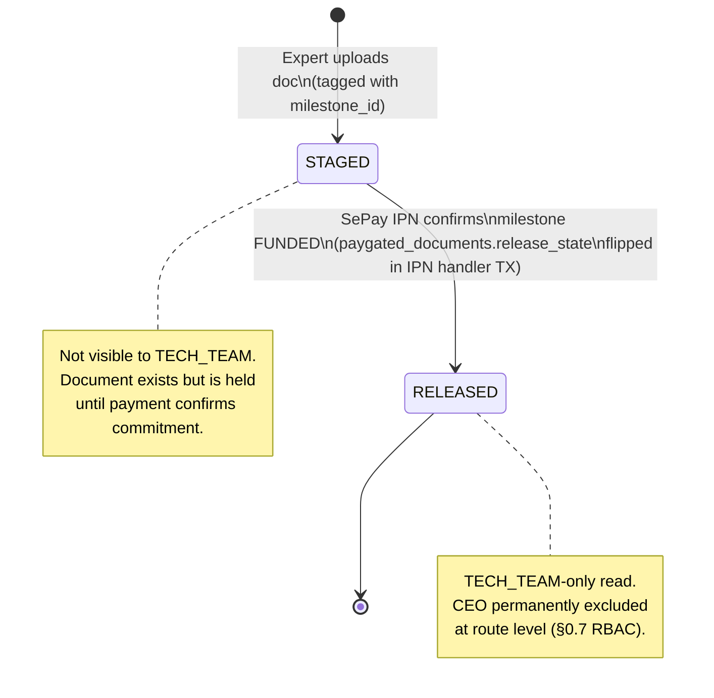

### State-by-State Narration

#### `[*]` → `STAGED`

- **Trigger:** Expert uploads reasoning document tagged to a milestone
- **DB Operation:**
  ```sql
  INSERT INTO paygated_documents
    (milestone_id, document_url, release_state, staged_at, released_at)
  VALUES (?, ?, 'STAGED', now(), NULL);
  ```
- **Tables:** `paygated_documents` (C)
- **Endpoint:** `POST /milestones/{id}/paygated-docs`

#### `STAGED` → `RELEASED`

- **Trigger:** SePay IPN confirms milestone FUNDED (happens within the IPN MILESTONE branch transaction)
- **DB Operation (part of the atomic IPN transaction):**
  ```sql
  UPDATE paygated_documents SET
    release_state = 'RELEASED',
    released_at = now()
  WHERE milestone_id = ?;
  ```
- **Tables:** `paygated_documents` (U — within same TX as `milestones.state = 'FUNDED'`)
- **Key Design:** Release is automatic and atomic with funding. No manual trigger needed.
- **Route Guard on read:**
  ```
  GET /milestones/{id}/paygated-docs
  Guard: paygated_documents.release_state = 'RELEASED'
    AND requester.active_role = 'CLIENT'
    AND requester.client_subtype = 'TECH_TEAM'
    AND requester.client_subtype != 'CEO'  -- CEO permanently excluded
  ```

### Cross-Table CRUD Map

```
milestones ──(1:N)──► paygated_documents
  .release_state CHECK IN ('STAGED','RELEASED')
  .released_at NULL until IPN fires

paygated_documents.release_state flips in same TX as:
  milestones.state → 'FUNDED'
  escrow_accounts.status → 'HELD'
  wallet_transactions [ESCROW_LOCK]
```

---

## 10. Dispute Resolution (2-Layer)

### Master Reference

- **§0.2 Seams:** Dispute criterion may reference seam performance
- **§0.6 Dispute states:** Simplified 2-layer (full 3-layer deferred)
- **§0.8 Payment Architecture:** Escrow FROZEN → distributed per resolution

### Mermaid State Diagram

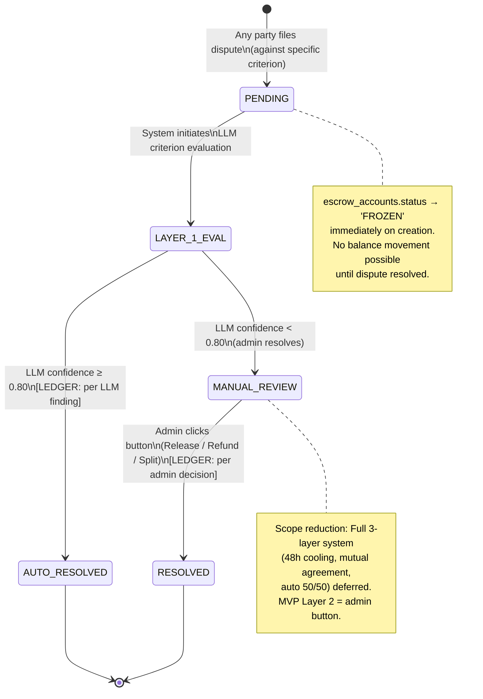

### State-by-State Narration

#### `[*]` → `PENDING`

- **Trigger:** Any party (Expert, CEO, TECH_TEAM) files a formal dispute
- **DB Operation:**
  ```sql
  INSERT INTO disputes
    (engagement_id, milestone_id, criterion_id, escrow_account_id,
     filed_by, state, llm_confidence, filed_at, resolved_at)
  VALUES (?, ?, ?, ?, ?, 'PENDING', NULL, now(), NULL);

  -- Freeze escrow immediately
  UPDATE escrow_accounts SET status = 'FROZEN' WHERE id = ?;
  ```
- **Tables:** `disputes` (C), `escrow_accounts` (U — `status = 'FROZEN'`)
- **Constraint:** `disputes.criterion_id` NOT NULL — disputes are always filed against a specific acceptance criterion
- **Constraint:** `disputes.escrow_account_id` NOT NULL — direct FK enables O(1) freeze
- **Endpoint:** `POST /disputes`

#### `PENDING` → `LAYER_1_EVAL`

- **Trigger:** System auto-initiates LLM evaluation
- **DB Operation:** `UPDATE disputes SET state = 'LAYER_1_EVAL' WHERE id = ?`
- **FastAPI Call:** `POST /llm/dispute-eval` — evaluates criterion text vs. deliverable
- **Tables:** `disputes` (U)

#### `LAYER_1_EVAL` → `AUTO_RESOLVED`

- **Trigger:** LLM confidence ≥ 0.80
- **DB Operation (atomic):**
  ```sql
  UPDATE disputes SET
    state = 'AUTO_RESOLVED',
    llm_confidence = ?,
    resolved_at = now()
  WHERE id = ?;

  -- Ledger distribution per LLM finding
  -- IF expert wins:
  UPDATE wallets SET locked_balance = locked_balance - amount WHERE id = client_wallet_id;
  UPDATE wallets SET available_balance = available_balance + net_amount WHERE id = expert_wallet_id;
  UPDATE wallets SET available_balance = available_balance + fee_amount WHERE id = platform_wallet_id;
  INSERT INTO wallet_transactions ...;  -- ESCROW_RELEASE, PLATFORM_FEE, CREDIT_EXPERT

  -- IF client wins:
  UPDATE wallets SET locked_balance = locked_balance - amount WHERE id = client_wallet_id;
  UPDATE wallets SET available_balance = available_balance + amount WHERE id = client_wallet_id;
  INSERT INTO wallet_transactions ...;  -- ESCROW_REFUND

  -- Update escrow
  UPDATE escrow_accounts SET status = 'RELEASED'|'REFUNDED', released_at = now() WHERE id = ?;

  -- Milestone reaches APPROVED regardless
  UPDATE milestones SET state = 'APPROVED', approved_at = now() WHERE id = ?;

  -- Log platform decision
  INSERT INTO platform_decisions
    (decision_type, entity_type, entity_id, llm_confidence, decision, created_at)
  VALUES ('DISPUTE_L1_EVAL', 'disputes', ?, ?, 'AUTO_RESOLVED', now());
  ```
- **Tables:** `disputes` (U), `wallets` (U), `wallet_transactions` (C), `escrow_accounts` (U), `milestones` (U), `platform_decisions` (C)
- **[LEDGER]:** Per LLM finding (either ESCROW_RELEASE chain or ESCROW_REFUND)

#### `LAYER_1_EVAL` → `MANUAL_REVIEW`

- **Trigger:** LLM confidence < 0.80
- **DB Operation:**
  ```sql
  UPDATE disputes SET
    state = 'MANUAL_REVIEW',
    llm_confidence = ?
  WHERE id = ?;

  INSERT INTO platform_decisions
    (decision_type, entity_type, entity_id, llm_confidence, decision, created_at)
  VALUES ('DISPUTE_L1_EVAL', 'disputes', ?, ?, 'ESCALATED_TO_MANUAL', now());
  ```
- **Tables:** `disputes` (U), `platform_decisions` (C)

#### `MANUAL_REVIEW` → `RESOLVED`

- **Trigger:** Admin clicks one of three buttons in Dispute Monitor
- **DB Operation (atomic):**
  ```sql
  UPDATE disputes SET state = 'RESOLVED', resolved_at = now() WHERE id = ?;

  -- Per admin choice:

  -- "Release to Expert":
  -- Same ledger as AUTO_RESOLVED expert wins (ESCROW_RELEASE + FEE + CREDIT)

  -- "Refund to Client":
  -- Same ledger as AUTO_RESOLVED client wins (ESCROW_REFUND)

  -- "Split 50/50":
  UPDATE wallets SET locked_balance = locked_balance - amount WHERE id = client_wallet_id;
  UPDATE wallets SET available_balance = available_balance + (amount / 2) WHERE id = client_wallet_id;
  UPDATE wallets SET available_balance = available_balance + (amount / 2) WHERE id = expert_wallet_id;
  INSERT INTO wallet_transactions
    (wallet_id, amount, transaction_type, reference_id, created_at) VALUES
    (client_wallet_id, amount/2, 'ESCROW_SPLIT', 'SPLIT_CLIENT:' || dispute_id, now()),
    (expert_wallet_id, amount/2, 'ESCROW_SPLIT', 'SPLIT_EXPERT:' || dispute_id, now());

  UPDATE escrow_accounts SET status = 'SPLIT', released_at = now() WHERE id = ?;
  UPDATE milestones SET state = 'APPROVED', approved_at = now() WHERE id = ?;
  ```
- **Tables:** `disputes` (U), `wallets` (U), `wallet_transactions` (C), `escrow_accounts` (U), `milestones` (U)
- **[LEDGER]:** Per admin decision
- **Endpoint:** `PUT /admin/disputes/{id}/resolve`
- **Guard:** `active_role = 'ADMIN'`

### Cross-Table CRUD Map

```
disputes (C on filing; U on every resolution transition)
  .criterion_id → acceptance_criteria.id (NOT NULL — always against a criterion)
  .escrow_account_id → escrow_accounts.id (NOT NULL — direct FK for O(1) freeze)
  .filed_by → users.id
  .state CHECK IN ('PENDING','LAYER_1_EVAL','AUTO_RESOLVED','MANUAL_REVIEW','RESOLVED')

escrow_accounts (U on FROZEN; U on RELEASED/REFUNDED/SPLIT)
  .status CHECK IN ('HELD','RELEASED','FROZEN','REFUNDED','SPLIT')

platform_decisions (C on L1 eval result)
  .decision_type = 'DISPUTE_L1_EVAL'

No dispute_resolution_reports table in MVP (cut)
No expert_seam_outcome_signals table in MVP (Tier 4 cut)
```

---

## 11. Wallet Transaction Types (Internal Ledger Flow)

### Master Reference

- **§0.8 Payment Architecture:** Full payment flow diagrams
- **§0.6 Wallet transaction types:** All 8 types defined
- **§0.6 Subscription states:** SUBSCRIPTION type
- **§0.6 Withdrawal states:** WITHDRAWAL type

### Mermaid Flow Diagram

```mermaid
stateDiagram-v2
    direction TB

    state "External Financial System" as Ext {
        [*] --> User_Bank_Account : Real World Money
    }

    state "Platform Internal Ledger" as Platform {
        state "Client Wallet\n(available_balance)" as Client_Avail
        state "Client Wallet\n(locked_balance)" as Client_Locked
        state "Expert Wallet\n(available_balance)" as Expert_Avail
        state "Platform Revenue Wallet\n(platform_settings.platform_wallet_id)" as Fee_Pool

        User_Bank_Account --> Client_Avail : TOP_UP\n[SePay IPN on WALLET_TOPUP VA]\navailable_balance += amount

        Client_Avail --> Client_Locked : ESCROW_LOCK\n[SePay IPN on MILESTONE VA]\navailable_balance -= amount\nlocked_balance += amount

        Client_Avail --> Fee_Pool : SUBSCRIPTION\n[POST /subscriptions/activate]\navailable_balance -= price\n(platform wallet credits for audit)

        state "Escrow Settlement" as Settlement {
            Client_Locked --> Expert_Avail : ESCROW_RELEASE\n[Milestone APPROVED]\nlocked_balance -= gross\nexpert available_balance += net\n(95% of amount)
            Client_Locked --> Fee_Pool : PLATFORM_FEE\n[Deducted on release]\nfee = amount × platform_fee_pct\n(READ from platform_settings;\nNOT hardcoded)
            Client_Locked --> Client_Avail : ESCROW_REFUND\n[Dispute: Client wins]\nlocked_balance -= amount\nclient available_balance += amount
            Client_Locked --> Client_Avail : ESCROW_SPLIT (50%)\n[Admin 50/50 resolution]\nlocked_balance -= full amount\nclient available_balance += 50%
            Client_Locked --> Expert_Avail : ESCROW_SPLIT (50%)\nexpert available_balance += 50%
        }

        Expert_Avail --> User_Bank_Account : WITHDRAWAL\n[SePay chi hộ API]\navailable_balance -= amount\n[API: POST chi hộ]
    }
```

### Transaction Type Narration

#### `TOP_UP` — External → Available

- **Trigger:** SePay IPN on WALLET_TOPUP VA
- **DB Operation:**
  ```sql
  UPDATE wallets SET available_balance = available_balance + ? WHERE user_id = ?;
  INSERT INTO wallet_transactions
    (wallet_id, amount, transaction_type, reference_id, created_at)
  VALUES (?, ?, 'TOP_UP', ?, now());
  -- reference_id = SePay transfer_reference
  ```
- **Tables:** `wallets` (U), `wallet_transactions` (C)
- **Idempotency:** `UNIQUE INDEX wallet_tx_idempotency ON wallet_transactions(wallet_id, reference_id) WHERE reference_id IS NOT NULL`
- **Flows:** MF-1 (Phase B), MF-11

#### `SUBSCRIPTION` — Available → Internal

- **Trigger:** User activates Pro tier
- **DB Operation:**
  ```sql
  UPDATE wallets SET available_balance = available_balance - ? WHERE user_id = ?;
  INSERT INTO wallet_transactions
    (wallet_id, amount, transaction_type, reference_id, created_at)
  VALUES (?, ?, 'SUBSCRIPTION', 'SUB:' || user_id || ':' || role_type, now());
  UPDATE users SET
    subscription_client_tier = 'pro',  -- or subscription_expert_tier
    sub_client_expires_at = now() + interval '6 months'
  WHERE id = ?;
  ```
- **Tables:** `wallets` (U), `wallet_transactions` (C), `users` (U)
- **Key Scope Reduction:** No `user_subscriptions` table. Subscription state stored directly on `users`. The `reference_id` pattern provides audit trail.
- **Flows:** MF-1 (Phase C), MF-13

#### `ESCROW_LOCK` — Available → Locked

- **Trigger:** SePay IPN on MILESTONE or SERVICE VA
- **DB Operation:**
  ```sql
  UPDATE wallets SET
    available_balance = available_balance - ?,
    locked_balance = locked_balance + ?
  WHERE user_id = ?;
  INSERT INTO wallet_transactions
    (wallet_id, amount, transaction_type, reference_id, created_at)
  VALUES (?, ?, 'ESCROW_LOCK', 'ESC_LOCK:' || milestone_id, now());
  ```
- **Tables:** `wallets` (U), `wallet_transactions` (C)
- **Flows:** MF-7 (milestone funding), MF-10 (service purchase)

#### `ESCROW_RELEASE` + `PLATFORM_FEE` + Expert Credit — Locked → Expert Available + Platform

- **Trigger:** Milestone APPROVED (all required criteria verified, or dispute resolved in expert's favor)
- **DB Operation:** See Milestone `SUBMITTED` → `APPROVED` narration for full atomic transaction
- **Key Design:** Platform fee is `SELECT platform_fee_pct FROM platform_settings LIMIT 1` — never hardcoded in application code
- **[API]:** Chi hộ fires after ledger commit
- **Flows:** MF-7 (sign-off), MF-8 (dispute expert wins), MF-18 (admin release)

#### `ESCROW_REFUND` — Locked → Client Available

- **Trigger:** Dispute resolved in client's favor
- **DB Operation:**
  ```sql
  UPDATE wallets SET
    locked_balance = locked_balance - ?,
    available_balance = available_balance + ?
  WHERE id = client_wallet_id;
  INSERT INTO wallet_transactions
    (wallet_id, amount, transaction_type, reference_id, created_at)
  VALUES (?, ?, 'ESCROW_REFUND', 'REFUND:' || dispute_id, now());
  ```
- **Flows:** MF-8 (dispute client wins), MF-18 (admin refund)

#### `ESCROW_SPLIT` — Locked → Both Available (50/50)

- **Trigger:** Admin chooses "Split 50/50" in Dispute Monitor
- **DB Operation:** See Dispute `MANUAL_REVIEW` → `RESOLVED` narration
- **Flows:** MF-18 (admin split)

#### `WITHDRAWAL` — Expert Available → External

- **Trigger:** Expert requests cash-out (or auto-triggered on milestone APPROVED)
- **DB Operation:**
  ```sql
  UPDATE wallets SET available_balance = available_balance - ? WHERE user_id = ?;
  INSERT INTO wallet_transactions
    (wallet_id, amount, transaction_type, reference_id, created_at)
  VALUES (?, ?, 'WITHDRAWAL', 'WD:' || withdrawal_id, now());
  INSERT INTO withdrawal_requests
    (expert_id, type, amount, bank_account_xid, status, requested_at)
  VALUES (?, 'EXPERT_MANUAL', ?, ?, 'PENDING', now());
  -- [API] POST SePay chi hộ
  ```
- **Flows:** MF-12

### Idempotency Guarantee

```sql
CREATE UNIQUE INDEX wallet_tx_idempotency
  ON wallet_transactions(wallet_id, reference_id)
  WHERE reference_id IS NOT NULL;
```

SePay IPN retries cannot double-credit. The second INSERT fails the unique constraint. The IPN handler returns 200 OK (preventing further retries) but takes no financial action.

---

## 12. Withdrawal States

### Master Reference

- **§0.8 Payment Architecture:** Chi hộ flow
- **§0.7 RBAC:** Expert-only action; requires `sepay_bank_account_xid` set

### Mermaid State Diagram

```mermaid
stateDiagram-v2
    direction TB

    [*] --> PENDING : Expert requests withdrawal\n(wallet debited atomically;\nchi hộ API called)

    PENDING --> PROCESSING : chi hộ API accepted\n(disbursement_id set)

    PROCESSING --> COMPLETED : SePay credit IPN confirms\n(expert's linked bank account)

    PENDING --> FAILED : chi hộ API error\n(wallet balance restored [LEDGER])
    PROCESSING --> FAILED : chi hộ timeout/error\n(wallet balance restored [LEDGER])

    COMPLETED --> [*]
    FAILED --> [*]

    note right of PENDING
        Guard: users.sepay_bank_account_xid
        IS NOT NULL (Bank Hub link required)
        Wallet debited BEFORE chi hộ call
        to prevent double-spend.
    end note
```

### State-by-State Narration

#### `[*]` → `PENDING`

- **Trigger:** Expert clicks "Withdraw" or milestone APPROVED auto-triggers
- **Guard:** `users.sepay_bank_account_xid IS NOT NULL`
- **Guard:** `wallets.available_balance >= amount`
- **DB Operation (atomic):**
  ```sql
  UPDATE wallets SET available_balance = available_balance - ? WHERE user_id = ?;
  INSERT INTO wallet_transactions
    (wallet_id, amount, transaction_type, reference_id, created_at)
  VALUES (?, ?, 'WITHDRAWAL', 'WD:' || ?, now());
  INSERT INTO withdrawal_requests
    (expert_id, type, amount, bank_account_xid, disbursement_id, status, requested_at, confirmed_at)
  VALUES (?, ?, ?, ?, NULL, 'PENDING', now(), NULL);
  -- type: 'EXPERT_MANUAL' (expert-initiated) or 'MILESTONE_RELEASE' (auto on APPROVED)
  ```
- **Tables:** `wallets` (U), `wallet_transactions` (C), `withdrawal_requests` (C)
- **[LEDGER]:** `WITHDRAWAL` — `available_balance -= amount`
- **[API]:** `POST SePay chi hộ: {amount, bank_account_xid, reference: "WD-{id}"}`
- **Endpoint:** `POST /withdrawals`

#### `PENDING` → `PROCESSING`

- **Trigger:** Chi hộ API accepts the request and returns a `disbursement_id`
- **DB Operation:**
  ```sql
  UPDATE withdrawal_requests SET
    disbursement_id = ?,
    status = 'PROCESSING'
  WHERE id = ?;
  ```
- **Tables:** `withdrawal_requests` (U)

#### `PROCESSING` → `COMPLETED`

- **Trigger:** SePay credit IPN fires on expert's linked bank account
- **DB Operation:**
  ```sql
  UPDATE withdrawal_requests SET
    status = 'COMPLETED',
    confirmed_at = now()
  WHERE id = ?;

  -- IF this was a MILESTONE_RELEASE:
  UPDATE milestones SET state = 'RELEASED', released_at = now() WHERE id = ?;
  -- IF last milestone:
  UPDATE engagements SET state = 'CLOSED' WHERE id = ?;
  ```
- **Tables:** `withdrawal_requests` (U), `milestones` (U — if MILESTONE_RELEASE), `engagements` (U — if last milestone)

#### `PENDING` / `PROCESSING` → `FAILED`

- **Trigger:** Chi hộ API error or timeout
- **DB Operation (atomic reversal):**
  ```sql
  -- Restore wallet balance
  UPDATE wallets SET available_balance = available_balance + ? WHERE user_id = ?;
  INSERT INTO wallet_transactions
    (wallet_id, amount, transaction_type, reference_id, created_at)
  VALUES (?, ?, 'WITHDRAWAL', 'WD:' || ? || ':REVERSAL', now());

  UPDATE withdrawal_requests SET status = 'FAILED' WHERE id = ?;
  ```
- **Tables:** `wallets` (U), `wallet_transactions` (C), `withdrawal_requests` (U)
- **[LEDGER]:** Reversal entry — `available_balance += amount`
- **Key Design:** Balance is restored atomically. Expert is notified with error details.

### Cross-Table CRUD Map

```
users.sepay_bank_account_xid → used as chi hộ target
  (set by Bank Hub BANK_ACCOUNT_LINKED webhook in MF-2)

withdrawal_requests
  .type CHECK IN ('MILESTONE_RELEASE','EXPERT_MANUAL')
  .status CHECK IN ('PENDING','PROCESSING','COMPLETED','FAILED')
  .bank_account_xid → from users.sepay_bank_account_xid

wallet_transactions [WITHDRAWAL] reference pattern: 'WD:{withdrawal_id}'
wallet_transactions [WITHDRAWAL REVERSAL] reference: 'WD:{id}:REVERSAL'
```

---

## 13. Subscription States

### Master Reference

- **§0.9 Subscription Tiers:** Feature gate matrix
- **§0.7 RBAC:** Subscription guard on all LLM/matching routes

### Mermaid State Diagram

```mermaid
stateDiagram-v2
    direction TB

    [*] --> free : Account created\n(users.subscription_{role}_tier = 'free')

    free --> pro : POST /subscriptions/activate\n(wallet deducted [LEDGER];\nusers.sub_{role}_expires_at = now + 6mo)

    pro --> EXPIRING_SOON : 7 days before\nusers.sub_{role}_expires_at\n(notification sent)

    EXPIRING_SOON --> pro : Renewal\n(new wallet deduction [LEDGER];\nnew expires_at)

    EXPIRING_SOON --> expired : expires_at passed\n(downgrade to free;\nactive engagements grandfathered)

    expired --> pro : Renewal\n(same wallet deduction flow)

    pro --> [*]
    expired --> [*]

    note right of free
        All LLM/matching routes return
        403 SUBSCRIPTION_REQUIRED.
        Subscription guard reads:
        users.subscription_{role}_tier
        + users.sub_{role}_expires_at
    end note

    note right of expired
        Grace: active engagements
        continue. New gated features
        blocked until renewal.
    end note
```

### State-by-State Narration

#### `free` → `pro`

- **Trigger:** User activates Pro subscription
- **Guards:**
  - `users.subscription_{role}_tier` not already `'pro'` (409 if already subscribed)
  - `wallets.available_balance >= price` (422 if insufficient)
- **DB Operation (atomic):**
  ```sql
  UPDATE wallets SET available_balance = available_balance - ? WHERE user_id = ?;
  INSERT INTO wallet_transactions
    (wallet_id, amount, transaction_type, reference_id, created_at)
  VALUES (?, ?, 'SUBSCRIPTION', 'SUB:' || user_id || ':' || role_type, now());
  UPDATE users SET
    subscription_client_tier = 'pro',  -- or subscription_expert_tier
    sub_client_expires_at = now() + interval '6 months'
  WHERE id = ?;
  ```
- **Tables:** `wallets` (U), `wallet_transactions` (C), `users` (U)
- **[LEDGER]:** `SUBSCRIPTION` — `available_balance -= price`
- **Endpoint:** `POST /subscriptions/activate`

#### `pro` → `EXPIRING_SOON`

- **Trigger:** 7 days before `users.sub_{role}_expires_at`
- **DB Operation:** No state column change — this is detected at query time. Notification sent.
- **Implementation:** Cron job or scheduled task checking `sub_{role}_expires_at BETWEEN now() AND now() + interval '7 days'`

#### `EXPIRING_SOON` / `expired` → `pro` (Renewal)

- **Trigger:** User renews subscription
- **DB Operation:** Same atomic flow as `free` → `pro` — wallet deduction + ledger entry + `users` update

#### Subscription Guard (Middleware)

- **Applied to:** Every FastAPI-calling route + matching engine + Artifact B access + add-on phase (future)
- **Logic:**
  ```
  IF users.subscription_{role}_tier = 'free'
     OR users.sub_{role}_expires_at < now()
  THEN return 403 {
    code: "SUBSCRIPTION_REQUIRED",
    feature: "elicitation_engine",
    upgrade_url: "/subscribe"
  }
  ```
- **Key Scope Reduction:** No `user_subscriptions` table. Guard reads directly from `users.subscription_client_tier` / `users.subscription_expert_tier` + `sub_client_expires_at` / `sub_expert_expires_at`.

### Cross-Table CRUD Map

```
users
  .subscription_client_tier  CHECK IN ('free','pro')
  .subscription_expert_tier  CHECK IN ('free','pro')
  .sub_client_expires_at     TIMESTAMPTZ NULL
  .sub_expert_expires_at     TIMESTAMPTZ NULL

wallets (U on subscription activation)
wallet_transactions (C — type='SUBSCRIPTION')

No user_subscriptions table in MVP.
Audit trail via wallet_transactions.reference_id = 'SUB:{user_id}:{role_type}'
```

---

## 14. Cross-Table CRUD Dependency Map

> **Every state transition in this document is grounded to specific table operations.** This map proves full coverage.

### Full Dependency Graph (28 Tables)

```
1.  users
      ├──(1:1)──► client_profiles           [C: MF-1]
      ├──(1:1)──► expert_profiles           [C: MF-2; U: stack_tags, archetype_history]
      ├──(1:1)──► tech_team_profiles        [C: MF-3; scoped by linked_project_id]
      ├──(1:1)──► wallets                   [C: MF-1/MF-2; U: every financial operation]
      │
2.  wallets
      ├──(1:N)──► wallet_transactions       [C: every financial event; IMMUTABLE]
      │             UNIQUE INDEX (wallet_id, reference_id) WHERE reference_id IS NOT NULL
      │             → idempotency guarantee for SePay IPN retries
      │
3.  virtual_accounts                        [C: MF-1 (TOPUP), MF-7 (MILESTONE), MF-10 (SERVICE)]
      .entity_type CHECK IN ('WALLET_TOPUP','MILESTONE','SERVICE','SUBSCRIPTION')
      .entity_id → polymorphic (user_id / milestone_id / engagement_id)
      .fixed_amount NULL for TOPUP; set for all others
      .expires_at NULL for TOPUP; 24h for others
      .status CHECK IN ('ACTIVE','EXPIRED','USED')
      │
4.  withdrawal_requests                     [C: MF-12; U: status transitions]
      .type CHECK IN ('MILESTONE_RELEASE','EXPERT_MANUAL')
      .status CHECK IN ('PENDING','PROCESSING','COMPLETED','FAILED')
      │
5.  platform_settings                       [SINGLETON — seeded at deploy]
      .platform_wallet_id → wallets.id (system wallet)
      .platform_fee_pct DEFAULT 0.05 (READ at transaction time; NOT hardcoded)
      │
6.  elicitation_sessions                    [C: MF-4; U: stage advances, state transitions]
      .state CHECK IN ('IN_PROGRESS','COMPLETED','ABANDONED','RETURNED')
      .current_stage CHECK BETWEEN 1 AND 5
      .archetype — locked after Stage 2
      .scenario_type — set in Stage 4 (STANDARD/SCENARIO_A/SCENARIO_B)
      .void_list_json — updated by LLM extraction
      │
7.  projects                                [C: MF-4 synthesis; U: state transitions]
      .state CHECK IN ('DRAFT','PUBLISHED','RETURNED_TO_CLIENT','SUSPENDED')
      .required_seams_json — §0.2 seams (feeds matching)
      .required_domains_json — §0.1 domains (feeds matching)
      .milestone_framework_json — milestone structure
      .artifact_a_json — public spec (visible to matched experts)
      .artifact_b_json — technical vault (route-gated per §0.7)
      │
8.  services                                [C: MF-9; U: state (DRAFT→PUBLISHED→SUSPENDED)]
      .service_type CHECK IN ('AI_SERVICE','TECH_DISCOVERY')
      │
9.  expert_domain_depths                    [C: MF-2; U: verification_tier]
      .depth_level CHECK IN ('SURFACE','OPERATIONAL','DEEP')
      .verification_tier CHECK IN ('CLAIMED','EVIDENCE_BACKED')
      UNIQUE (expert_id, domain_code)
      │
10. expert_seam_claims                      [C: MF-2; U: verification_tier, submission_count, locked_until]
      .verification_tier CHECK IN ('CLAIMED','EVIDENCE_BACKED')
      .submission_count — 5-attempt throttle
      .locked_until — 30-day lockout after 5 failures
      UNIQUE (expert_id, seam_code)
      │
11. portfolio_submissions                   [C: MF-2/MF-16; U: status, llm_confidence, evaluated_at]
      .status CHECK IN ('PENDING','APPROVED','REJECTED')
      .seam_claim_id → expert_seam_claims.id
      │
12. engagements                             [C: MF-6/MF-10; U: state, nda timestamps]
      .type CHECK: PROJECT_BASED (project_id NOT NULL) OR SERVICE_PURCHASE/TECH_DISCOVERY (service_id NOT NULL)
      .state CHECK IN ('PENDING','CONNECTED','ACTIVE','CLOSED','DISPUTED')
      .type IMMUTABLE after creation
      │
13. capability_bids                         [C: MF-6; U: every bid transition]
      .engagement_id UNIQUE (1:1)
      .state CHECK IN ('DRAFT','SUBMITTED','TECH_REVIEW','REVISION_REQUESTED',
                       'TECH_APPROVED','CEO_REVIEW','SELECTED','DECLINED')
      .tech_status CHECK IN ('PENDING','APPROVED','REVISION_REQUESTED')
      .ceo_status CHECK IN ('PENDING','APPROVED','DECLINED')
      .tech_feedback TEXT NULL — replaces cut bid_revision_requests table
      .negotiated_price_vnd BIGINT NULL — replaces cut price_negotiations table
      .version_number INT DEFAULT 1 — simple counter, no FK to version table
      │
14. milestones                              [C: MF-7; U: every milestone transition]
      .state CHECK IN ('DEFINED','AWAITING_PAYMENT','FUNDED','IN_PROGRESS',
                       'SUBMITTED','IN_REVISION','APPROVED','RELEASED','DISPUTED')
      .sign_off_authority CHECK IN ('TECH_TEAM','CEO','JOINT')
      UNIQUE (engagement_id, milestone_number)
      │
15. acceptance_criteria                     [C: MF-7; U: verified_at, revision_note]
      .verified_by_role CHECK IN ('TECH_TEAM','CEO','JOINT')
      .revision_note TEXT NULL — absorbs cut revision_requests table
      │
16. milestone_dod_items                     [C: MF-7; U: status, completed_at, notes]
      .status CHECK IN ('PENDING','COMPLETED','NOT_APPLICABLE')
      CONSTRAINT: NOT (is_required = TRUE AND status = 'NOT_APPLICABLE')
      .maps_to_criterion_id → acceptance_criteria.id (nullable)
      │
17. milestone_submissions                   [C: MF-7 submit/resubmit]
      │
18. paygated_documents                      [C: MF-14 staging; U: release_state in IPN TX]
      .release_state CHECK IN ('STAGED','RELEASED')
      │
19. escrow_accounts                         [C: MF-7/MF-10; U: status]
      .status CHECK IN ('HELD','RELEASED','FROZEN','REFUNDED','SPLIT')
      CONSTRAINT: escrow_has_one_parent — exactly one of milestone_id/engagement_id
      Partial unique indexes on milestone_id and engagement_id
      │
20. disputes                                [C: MF-8; U: state transitions]
      .state CHECK IN ('PENDING','LAYER_1_EVAL','AUTO_RESOLVED','MANUAL_REVIEW','RESOLVED')
      .criterion_id NOT NULL — always against a specific criterion
      .escrow_account_id NOT NULL — direct FK for O(1) freeze
      │
21. messages                                [C: MF-6/MF-9 messaging; R: history]
      .engagement_id → engagements.id (thread key)
      │
22. message_reads                           [C: on read; R: unread count]
      UNIQUE (message_id, user_id)
      │
23. reviews                                 [C: MF-11 post-engagement]
      .structured_signals_json JSONB — absorbs cut outcome_signals table
      .reviewer_role CHECK IN ('CEO','TECH_TEAM','EXPERT')
      UNIQUE (engagement_id, reviewer_id)
      │
24. platform_decisions                      [C: every LLM/AI decision; R: admin dashboard]
      .decision_type CHECK IN ('ELICITATION_SYNTHESIS','SPEC_AUTO_RETURN',
                               'SEAM_TIER_UPGRADE','PORTFOLIO_EVAL',
                               'DISPUTE_L1_EVAL','CRITERION_QUALITY_GATE')
      .entity_id — polymorphic (no FK; standalone)
      │
25-28. (client_profiles, expert_profiles, tech_team_profiles, platform_settings)
      — See individual entries above
```

### Scope Reduction: What Was Cut and Where It Went

| Full Spec Table | MVP Status | Replacement | Lives In |
|---|---|---|---|
| `user_subscriptions` | CUT | Subscription columns on `users` | `users.subscription_{role}_tier`, `.sub_{role}_expires_at` |
| `capability_footprints` | CUT | JSONB columns on `projects` | `projects.required_seams_json`, `.required_domains_json`, `.milestone_framework_json` |
| `artifact_a` | CUT | JSONB column on `projects` | `projects.artifact_a_json` |
| `artifact_b` | CUT | JSONB column on `projects` | `projects.artifact_b_json` |
| `spec_clarifications` | CUT | `messages` channel | `messages` table |
| `bid_versions` | CUT | `version_number` counter | `capability_bids.version_number` |
| `bid_revision_requests` | CUT | `tech_feedback` column | `capability_bids.tech_feedback` |
| `price_negotiations` | CUT | `negotiated_price_vnd` column | `capability_bids.negotiated_price_vnd` |
| `bid_conflict_overrides` | CUT | Independent `tech_status`/`ceo_status` | `capability_bids` dual columns |
| `revision_requests` | CUT | `revision_note` column | `acceptance_criteria.revision_note` |
| `milestone_sprints` | CUT | Deferred to Phase 2 | — |
| `sprint_status_updates` | CUT | Deferred to Phase 2 | — |
| `addon_phase_requests` | CUT | Deferred to Phase 2 | — |
| `scenario_assessments` | CUT | Deferred to Phase 2 (Tier 3) | — |
| `scenario_responses` | CUT | Deferred to Phase 2 (Tier 3) | — |
| `expert_seam_outcome_signals` | CUT | Deferred to Phase 2 (Tier 4) | — |
| `dispute_resolution_reports` | CUT | Deferred to Phase 2 | — |
| `outcome_signals` | CUT | `structured_signals_json` | `reviews.structured_signals_json` |
| `expert_stack_tags` | CUT | `stack_tags_json` JSONB | `expert_profiles.stack_tags_json` |
| `organizations` | CUT | Schema-only Phase 2 | — |
| `organization_members` | CUT | Schema-only Phase 2 | — |

### Total: 28 Tables

Every state machine in this document operates exclusively on these 28 tables. Every transition has a defined CRUD operation, endpoint, and constraint. The system is fully grounded and buildable within the 9-week window.